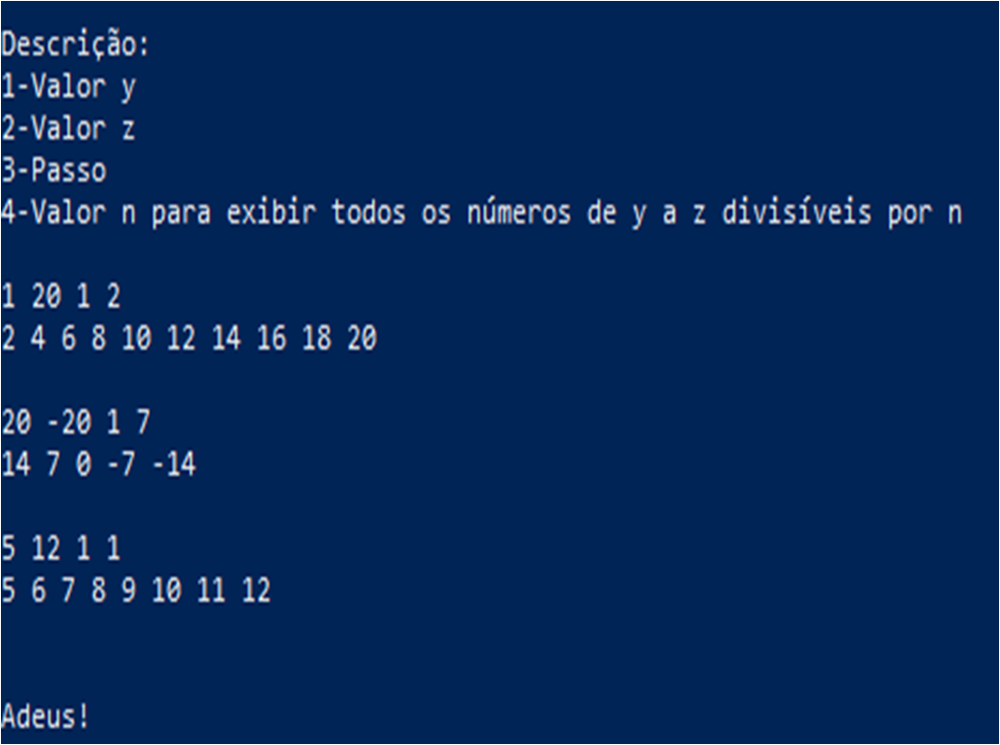
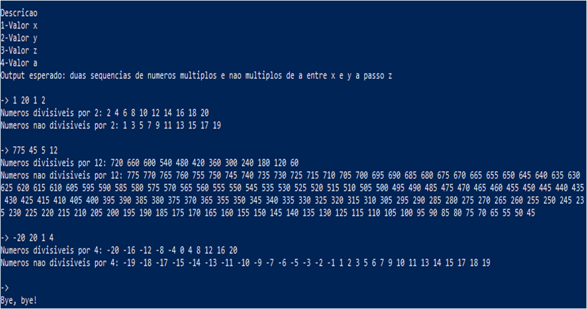
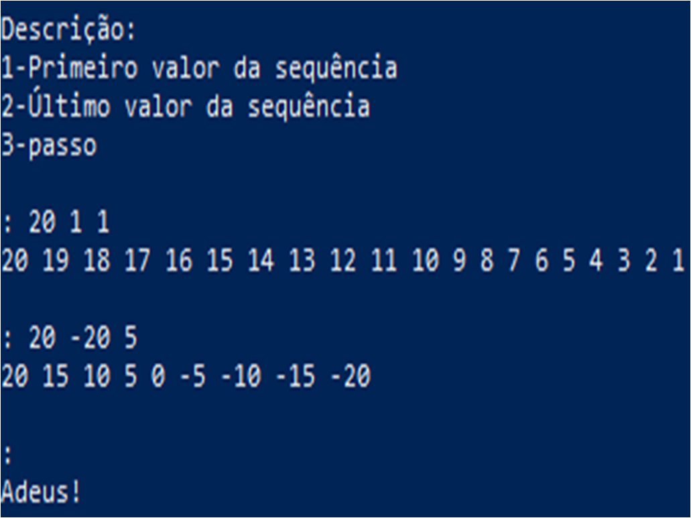
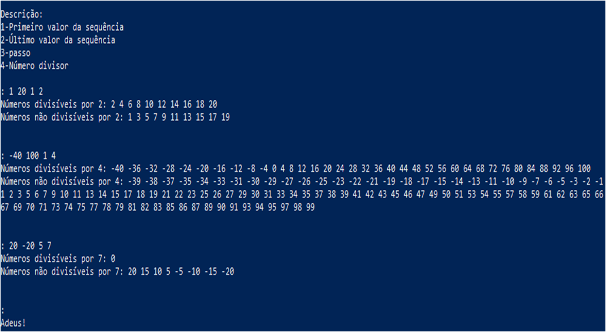
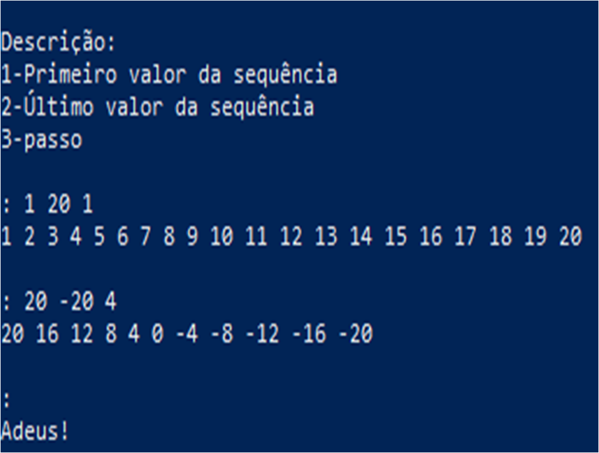
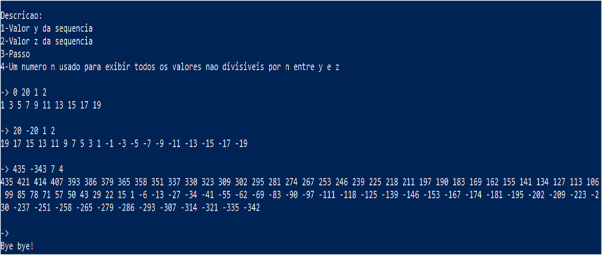
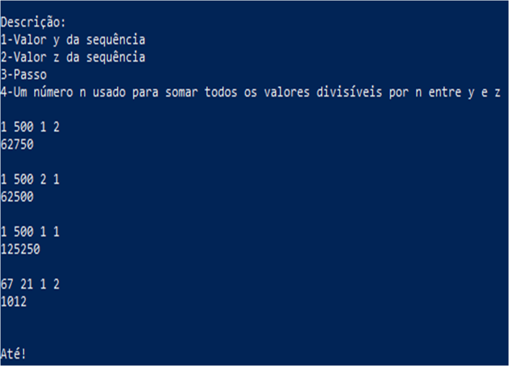
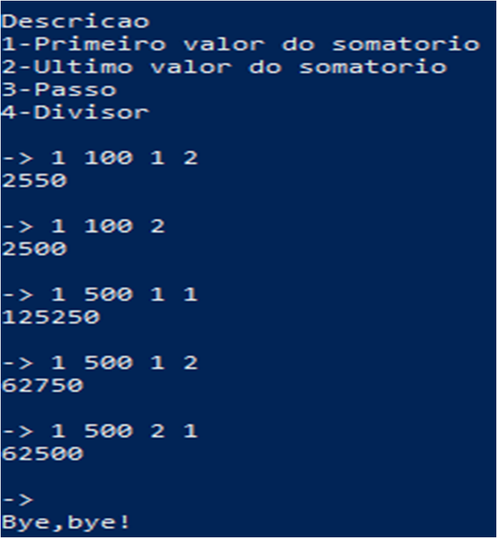
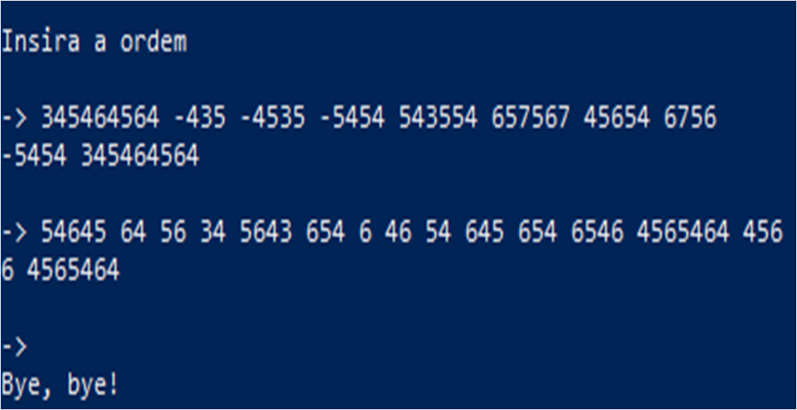

# Lista 3
# Sumário
- ## <a href="#casa-1">Casa</a>
    - ### <a href="#grifo-1-2">Grifo 1</a>
    - ### <a href="#grifo-2-2">Grifo 2</a>
    - ### <a href="#grifo-3-2">Grifo 3</a>
    - ### <a href="#grifo-4-2">Grifo 4</a>
    - ### <a href="#grifo-5-2">Grifo 5</a>
    - ### <a href="#grifo-6-2">Grifo 6</a>
    - ### <a href="#grifo-7-2">Grifo 7</a>
    - ### <a href="#grifo-8-2">Grifo 8</a>
    - ### <a href="#grifo-9-2">Grifo 9</a>
    - ### <a href="#grifo-10-2">Grifo 10</a>
    - ### <a href="#grifo-11-2">Grifo 11</a>
- ## <a href="#sala-1">Sala</a>
    - ### <a href="#grifo-1-3">Grifo 1</a>
    - ### <a href="#grifo-2-3">Grifo 2</a>
    - ### <a href="#grifo-3-3">Grifo 3</a>
    - ### <a href="#grifo-4-3">Grifo 4</a>
    - ### <a href="#grifo-5-3">Grifo 5</a>
    - ### <a href="#grifo-6-3">Grifo 6</a>
    - ### <a href="#grifo-7-3">Grifo 7</a>
    - ### <a href="#grifo-8-3">Grifo 8</a>
    - ### <a href="#grifo-9-3">Grifo 9</a>
    - ### <a href="#grifo-10-3">Grifo 10</a>
    - ### <a href="#grifo-11-3">Grifo 11</a>
<br>


Criatura comum, geralmente encontrada nas planíces do reino Web. 

<br>

# Nota
Foi percebido, durante o desenvolvimento da atividade, padrões como loops e splits de inputs. Como forma de auxiliar na hora de programar e de evitar a desanimação na programação C, foran criados dois arquivos contendo as funções que contém os padrões, logo acima citados. Esses são funcoes.h e funcoes.c
## Funcao.h
```h
#ifndef FUNCOES_H
#define FUNCOES_H
//
#define MAX_SIZE_STRING 1000

void looop(int valores[], int**nm, int op);
void string_to_int(char txt[],int *conjunto);
int termos(char*texto);
void merge_sort(int array[],int init,int end);

#endif
```
## Funcao.c
```c
#include"funcoes.h"
#include<stdlib.h>
#include<stdbool.h>
#include<string.h>
//
void looop(int valores[], int**nm, int op){
    int divi=1,q=0,*temp,e[2]={0,0},*aux;
    bool mudar=false;
    for(int i=0;i<4;++i){
        if(valores[i]==0&&i>1)
            break;
        ++q;
    }
    if(q==4)
        divi=valores[3];
    else if(q>4||q<2)
        return;
    if(q<3)
        valores[2]=1;
    if(valores[0]>valores[1]){
        valores[0]-=valores[1];
        valores[1]+=valores[0];
        valores[0]=valores[1]-valores[0];
        mudar=true;
    }
    temp=(int*)calloc(1,sizeof(*temp));
    mudar?*temp=valores[1]:!mudar?*temp=valores[0]:*temp;
    for(int i=0;i<2;++i){
        nm[i]=(int*)calloc((valores[1]-valores[0])/valores[2],sizeof(int));
    }
    if(op==0){
        for(int i=valores[0];i<valores[1]+1;i+=valores[2]){
            if(*temp%divi){
                nm[1][e[1]]=*temp;
                ++e[1];
            } else{
                nm[0][e[0]]=*temp;
                ++e[0];
            }
            mudar?*temp-=valores[2]:!mudar?*temp+=valores[2]:*temp;
        }
    } else if(op==1){
        aux=(int*)malloc(1*sizeof(*aux));
        *aux=valores[0];
        while(*aux<=valores[1]){
            if(*temp%divi){
                nm[1][e[1]]=*temp;
                ++e[1];
            }else{
                nm[0][e[0]]=*temp;
                ++e[0];
            }
            mudar?*temp-=valores[2]:!mudar?*temp+=valores[2]:*temp;
            *aux+=valores[2];
        }
        free(aux);
    } else if(op==2){
        aux=(int*)malloc(1*sizeof(*aux));
        *aux=valores[0];
        do{
            if(*temp%divi){
                nm[1][e[1]]=*temp;
                ++e[1];
            }else{
                nm[0][e[0]]=*temp;
                ++e[0];
            }
            mudar?*temp-=valores[2]:!mudar?*temp+=valores[2]:*temp;
            *aux+=valores[2];
        } while(*aux<=valores[1]);
        free(aux);
    }
};
//
void string_to_int(char txt[],int conjunto[]){
    int e_1=0,e_2=0,e_3=0,ascii;
    bool epaco=true;
    char*aux;
    for(int i=0;i<MAX_SIZE_STRING;++i){
        ascii=(int)txt[i];
        if(ascii<48||ascii>57){
            if(ascii!=32&&ascii!=45)
                break;
        }
        ++e_1;
    }
    txt[e_1]=' ';
    aux=(char*)malloc(e_1*sizeof(char));
    for(int i=0;i<e_1+1;++i){
        if((int)txt[i]==32){
            if(!epaco){
                epaco=true;
                conjunto[e_3]=atoi(aux);
                for(int j=0;j<e_2;++j){
                    aux[j]='_';
                }
                e_2=0;
                ++e_3;
            }
        } else{
            epaco=false;
            aux[e_2]=txt[i];
            ++e_2;
        }
    }
}
//
int termos(char*texto){
    int quant=0,ascii;
    bool epaco=true;
    for(int i=0;i<MAX_SIZE_STRING;++i){
        ascii=(int)texto[i];
        if(ascii==32&&!epaco){
            ++quant;
            epaco=true;
        } else if(ascii<32||ascii>126){
            break;
        } else if(ascii>32&&ascii<126){
            epaco=false;
        }
    }
    return quant+1;
}
//
void merge(int lista[],int inicio,int mind,int fim){
    int aux1,aux2,index=inicio,im=mind-inicio+1,me=fim-mind,i_m[im],m_e[me];
    for(int i=0;i<im;++i){
        i_m[i]=lista[inicio+i];
    }
    for(int i=0;i<me;++i){
        m_e[i]=lista[mind+i+1];
    }
    aux1=0;
    aux2=0;
    while(aux1<im&&aux2<me){
        if(i_m[aux1]<=m_e[aux2]){
            lista[index]=i_m[aux1];
            ++aux1;
        } else{
            lista[index]=m_e[aux2];
            ++aux2;
        }
        ++index;
    }
    for(aux1;aux1<im;++aux1){
        lista[index]=i_m[aux1];
        ++index;
    }
    for(aux2;aux2<me;++aux2){
        lista[index]=m_e[aux2];
        ++index;
    }
}
//
void merge_sort(int array[],int init,int end){
    if(init<end){
        int meio=init+(end-init)/2;
        merge_sort(array,init,meio);
        merge_sort(array,meio+1,end);
        merge(array,init,meio,end);
    }
}
```
Dado isso, a visualização da atividade pode começar.
<br>

# Casa
## Grifo 1
### Enunciado
Elaborar um programa que escreva em tela os números de 1 a 20, utilizando o
comando while( ).
### Res. Pyhton
```py
print('\nDescrição:\n1-Primeiro valor da sequência\n2-Último valor da sequência\n3-passo\n')
while len(x:=list(map(int,input(': ').split())))>1:
    mudar=False
    if x[0]>x[1]: 
        x[0],x[1]=x[1],x[0]
        mudar=True
    temp=x[0]
    temp=x[1] if mudar else temp
    while x[0]<x[1]+1:
        print(temp,end=' ')
        temp+=x[2] if mudar==False else 0
        temp-=x[2] if mudar else 0
        x[0]+=x[2]
    print('\n')
print('Até!\n')
```
#### Exemplo de Input+Output

### Res. C
```c
#include<stdio.h>
#include<stdlib.h>
#include"../funcoes.h"
//
void main(){
    char*inp;
    int *v,**receba;
    printf("\nDescricao\n1-Valor x\n2-Valor y\n3-Valor z\nOutuput esperado: sequencia numerica de x a y a passo z\n\n");
    for(;;){
        inp=(char*)malloc(1000*sizeof(*inp));
        printf("-> ");
        fgets(inp,1000,stdin);
        if(termos(inp)==1)
            break;
        v=(int*)calloc(3,sizeof(*v));
        string_to_int(inp,v);
        free(inp);
        receba=(int**)malloc(2*sizeof(*receba));
        looop(v,receba,1);
        for(int i=0;i<(v[1]-v[0])/v[2]+1;++i){
            if(receba[0][i]==0&&i>0&&receba[0][i+1]==0)
                break; 
            printf("%i ",receba[0][i]);
        }
        printf("\n\n");
        free(v);
        free(receba);
    }
    printf("Bye, bye!\n\n");
}
```
#### Exemplo de Input+Output

### Bônus(C++)
```cpp
#include<iostream>
#include<cstring>
#include"../bi.cpp"
//
int main(){
    std::string inp;
    char*split,*slot;
    double v[3],*aux,bgl,e;
    bool mudar;
    for(;;){
        std::getline(std::cin,inp);
        if(inp.length()<1){
            break;
        }
        split=std::strtok(&inp[0]," ");
        for(int i=0;split!=NULL;++i){
            v[i]=strtod(split,&slot);
            split=std::strtok(NULL," ");
        }
        if(v[0]>v[1]){
            v[1]+=v[0];
            v[0]-=v[1];
            v[1]+=v[0];
            v[0]*=-1;
            aux=new double(v[1]+v[0]);
            mudar=true;
        }
        e=v[0];
        while(e<=v[1]){
            (mudar)?bgl=*aux-e:bgl=e;
            std::cout<<bgl<<" ";
            e+=v[2];
        }
        (mudar)?mudar=false:mudar;
        std::cout<<std::endl;
        delete aux;
        aux=NULL;
        inp.clear();
    }
    std::cout<<conver("Hasta la Vista!",5)<<std::endl;
    return 0;
}
```
## Grifo 2
### Enunciado
Elaborar um programa que escreva em tela todos os números pares existentes
entre 20 e 1, utilizando o comando while( ).
### Res. Pyhton
```py
print('\nDescrição:\n1-Valor y\n2-Valor z\n3-Passo\n4-Valor n para exibir todos os números de y a z divisíveis por n\n')
while len(x:=list(map(int,input().split())))>0:
    mudar=False
    if x[0]>x[1]:
        x[0],x[1]=x[1],x[0]
        mudar = True
    temp=x[0]
    temp=x[1] if mudar else temp
    while x[0]<x[1]+1:
        print(temp,end=' ') if temp%x[3]==0 else 0
        temp+=x[2] if mudar==False else 0
        temp-=x[2] if mudar else 0
        x[0]+=x[2]
    print('\n')
print('Adeus!\n')
```
#### Exemplo de Input+Output

### Res. C
```c
#include<stdio.h>
#include<stdlib.h>
#include"../funcoes.h"
//
void main(){
    char*inp;
    int*v,**receba;
    printf("\nDescricao\n1-Valor x\n2-Valor y\n3-Valor z\n4-Valor a\nOutput esperado: uma sequencia de todos os numeros multiplos de a na sequencia de x a y a passo z\n\n");
    for(;;){
        inp=(char*)malloc(1000*sizeof(*inp));
        printf("-> ");
        fgets(inp,1000,stdin);
        if(termos(inp)==1)
            break;
        v=(int*)calloc(4,sizeof(*v));
        string_to_int(inp,v);
        free(inp);
        receba=(int**)malloc(2*sizeof(int*));
        looop(v,receba,1);
        for(int i=0;i<(v[1]-v[0])/v[2]+1;++i){
            if(receba[0][i]==0&&i>0&&receba[0][i+1]==0)
                break;
            printf("%i ",receba[0][i]);
        }
        printf("\n\n");
    }
    printf("Bye, bye!\n\n");
}
```
#### Exemplo de Output+Input

### Bônus(C++)

## Grifo 3
### Enunciado
Elaborar um programa que escreva em tela os números de 1 a 20, informando
quando eles são pares e quando são ímpares, utilizando o comando while( ).
### Res. Python
```py
print('\nDescrição:\n1-Primeiro valor da sequência\n2-Último valor da sequência\n3-passo\n4-Número divisor\n')
while len(x:=list(map(int,input().split())))>0:
    mudar=False
    if x[0]>x[1]:
        x[0],x[1]=x[1],x[0]
        mudar=True
    divi,temp=[[],[]],x[0]
    temp=x[1] if mudar else temp
    while x[0]<x[1]+1:
        divi[1].append(temp) if temp%x[3] else divi[0].append(temp)
        temp+=x[2] if not mudar else 0
        temp-=x[2] if mudar else 0
        x[0]+=x[2]
    for i in range(2):
        print('Números',end='')
        if i==1:
            print(' não',end='')
        print(' Divisíveis por {}: '.format(x[3]),end='')
        for j in divi[i]:
            print(j,end=' ')
        print()
    print()
print('Adeus!\n')
```
#### Exemplo de Output+Input

### Res. C
```c
#include<stdio.h>
#include<stdlib.h>
#include"../funcoes.h"
//
void main(){
    char*inp;
    int*v,**receba;
    printf("\nDescricao\n1-Valor x\n2-Valor y\n3-Valor z\n4-Valor a\nOutput esperado: duas sequencias de numeros multiplos e nao multiplos de a entre x e y a passo z\n\n");
    for(;;){
        inp=(char*)malloc(1000*sizeof(char));
        printf("-> ");
        fgets(inp,1000,stdin);
        if(termos(inp)==1){
            break;
        }
        v=(int*)calloc(4,sizeof(int));
        string_to_int(inp,v);
        free(inp);
        receba=(int**)malloc(2*sizeof(int*));
        looop(v,receba,1);
        for(int i=0;i<2;++i){
            printf("Numeros");
            if(i==1)
                printf(" nao");
            printf(" divisiveis por %i: ",v[3]);
            for(int j=0;j<(v[1]-v[0])/v[2]+1;++j){
                if(receba[i][j]==0&&j>0&&receba[i][j+1]==0)
                    break;
                printf("%i ",receba[i][j]);
            }
            printf("\n");
        }
        printf("\n");
        free(v);
        free(receba);
    }
    printf("Bye, bye!\n\n");
}
```
#### Exemplo de Output+Input

### Bônus(C++)
```cpp

```
#### Exemplo de Output+Input

## Grifo 4
### Enunciado
Elaborar um programa que escreva em tela os números de 20 a 1, utilizando o
comando for( ).
### Res. Python
```py
print('\nDescrição:\n1-Primeiro valor da sequência\n2-Último valor da sequência\n3-passo\n')
while len(x:=list(map(int,input(': ').split())))>1:
    mudar=False
    if x[0]>x[1]:
        x[0],x[1]=x[1],x[0]
        mudar=True
    temp=x[1] if mudar else x[0]
    for i in range(x[0],x[1]+1,x[2]):
        print(temp,end=' ')
        temp+=x[2] if not mudar else -x[2]
    print('\n')
print('Adeus!\n')
```
#### Exemplo de Output+Input

### Res. C
```c
#include<stdio.h>
#include<stdlib.h>
#include"../funcoes.h"
//
void main(){
    char*inp;
    int*v,**receba;
    printf("\nDescricao\n1-Valor x\n2-Valor y\n3-Valor z\nOutuput esperado: sequencia numerica de x a y a passo z\n\n");
    for(;;){
        inp=(char*)malloc(1000*sizeof(*inp));
        printf("-> ");
        fgets(inp,1000,stdin);
        if(termos(inp)==1)
            break;
        v=(int*)calloc(3,sizeof(*v));
        string_to_int(inp,v);
        free(inp);
        receba=(int**)malloc(2*sizeof(int*));
        looop(v,receba,0);
        for(int i=0;i<(v[1]-v[0])/v[2]+1;++i){
            if(receba[0][i]==0&&i>0&&receba[0][i+1]==0)
                break;
            printf("%i ",receba[0][i]);
        }
        free(v);
        free(receba);
        printf("\n\n");
    }
    printf("Bye, bye!\n\n");
}
```
#### Exemplo de Output+Input

### Bônus(C++)
```cpp

```
#### Exemplo de Output+Input

## Grifo 5
### Enunciado
Elaborar um programa que escreva em tela todos os números impares existentes
entre 1 e 20, utilizando o comando for( ).
### Res. Python
```py
print('\nDescrição:\n1-Valor y\n2-Valor z\n3-Passo\n4-Valor n para exibir todos os números de y a z não divisíveis por n\n')
while len(x:=list(map(int,input(': ').split())))>1:
    mudar=False
    if x[0]>x[1]: 
        x[0],x[1]=x[1],x[0]
        mudar=True
    temp=x[0] if not mudar else x[1]
    for i in range(x[0],x[1]+1,x[2]):
        print(temp,end=' ') if temp%x[3] else 0
        temp+=x[2] if not mudar else -x[2]
    print('\n')
print('Adeus!\n')
```
#### Exemplo de Output+Input

### Res. C
```c
#include<stdio.h>
#include<stdlib.h>
#include"../funcoes.h"
//
void main(){
    char*inp;
    int*v,**receba;
    printf("\nDescricao\n1-Valor x\n2-Valor y\n3-Valor z\n4-Valor a\nOutput esperado: uma sequencia de todos os numeros nao multiplos de a na sequencia de x a y a passo z\n\n");
    for(;;){
        inp=(char*)malloc(1000*sizeof(*inp));
        printf("-> ");
        fgets(inp,1000,stdin);
        if(termos(inp)==1)
            break;
        v=(int*)calloc(4,sizeof(*v));
        string_to_int(inp,v);
        free(inp);
        receba=(int**)malloc(2*sizeof(*receba));
        looop(v,receba,0);
        for(int i=0;i<(v[1]-v[0])/v[2];++i){
            if(receba[1][i]==0&&receba[1][i+1]==0)
                break;
            printf("%i ",receba[1][i]);
        }
        free(v);
        free(receba);
        printf("\n\n");
    }
    printf("Bye, bye!\n\n");
}
```
#### Exemplo de Output+Input

### Bônus(C++)
```cpp

```
#### Exemplo de Output+Input

## Grifo 6
### Enunciado
Elaborar um programa que escreva em tela os números de 20 a 1, informando
quando eles são pares e quando são ímpares, utilizando o comando for( ).
### Res. Python
```py
print('\nDescrição:\n1-Primeiro valor da sequência\n2-Último valor da sequência\n3-passo\n4-Número divisor\n')
while len(x:=list(map(int,input(': ').split())))>1:
    mudar=False
    if x[0]>x[1]:
        x[0],x[1]=x[1],x[0]
        mudar=True
    temp=x[1] if mudar else x[0]
    divi=[[],[]]
    for i in range(x[0],x[1]+1,x[2]):
        divi[1].append(temp) if temp%x[3] else divi[0].append(temp)
        temp+=x[2] if not mudar else -x[2]
    for i in range(2):
        print('Números',end='')
        if i==1: print(' não',end='')
        print(' divisíveis por {}: '.format(x[3]),end='')
        for j in divi[i]:
            print(j,end=' ')
        print()
    print('\n')
print('Adeus!\n')
```
#### Exemplo de Output+Input

### Res. C
```c
#include<stdio.h>
#include<stdlib.h>
#include"../funcoes.h"
//
void main(){
    char*inp;
    int*v,**receba;
    printf("\nDescricao\n1-Valor x\n2-Valor y\n3-Valor z\n4-Valor a\nOutput esperado: duas sequencias de numeros multiplos e nao multiplos de a entre x e y a passo z\n\n");
    for(;;){
        inp=(char*)malloc(1000*sizeof(*inp));
        printf("-> ");
        fgets(inp,1000,stdin);
        if(termos(inp)==1)
            break;
        v=(int*)calloc(4,sizeof(int));
        string_to_int(inp,v);
        receba=(int**)malloc(2*sizeof(int*));
        free(inp);
        looop(v,receba,0);
        for(int i=0;i<2;++i){
            printf("Numeros");
            if(i==1)
                printf(" nao");
            printf(" divisiveis por %i: ",v[3]);
            for(int j=0;j<(v[1]-v[0])/v[2]+1;++j){
                if(receba[i][j]==0&&receba[i][j+1]==0)
                    break;
                printf("%i ",receba[i][j]);
            }
            printf("\n");
        }
        printf("\n");
        free(v);
        free(receba);
    }
    printf("Bye, bye!\n\n");
}
```
#### Exemplo de Output+Input

### Bônus(C++)
```cpp

```
#### Exemplo de Output+Input

## Grifo 7
### Enunciado
Elaborar um programa que escreva em tela os números de 1 a 20, utilizando o
comando do-while( ).
### Res. Python
```py
print('\nDescrição:\n1-Primeiro valor da sequência\n2-Último valor da sequência\n3-passo\n')
while len(x:=list(map(int,input(': ').split())))>1:
    mudar=False
    if x[0]>x[1]:
        x[0],x[1]=x[1],x[0]
        mudar=True
    temp=x[1] if mudar else x[0]
    while True:
        print(temp,end=' ')
        temp+=x[2] if not mudar else -x[2]
        x[0]+=x[2]
        if x[0]>x[1]:
            break
    print('\n')
print('Adeus!\n')
```
#### Exemplo de Output+Input

### Res. C
```c
#include<stdio.h>
#include<stdlib.h>
#include"../funcoes.h"
//
int main(){
    char*inp;
    int*v,**receba;
    printf("\nDescricao\n1-Valor x\n2-Valor y\n3-Valor z\nOutuput esperado: sequencia numerica de x a y a passo z\n\n");
    for(;;){
        inp=(char*)malloc(1000*sizeof(*inp));
        printf("-> ");
        fgets(inp,1000,stdin);
        if(termos(inp)==1)
            break;
        v=(int*)malloc(3*sizeof(int));
        string_to_int(inp,v);
        free(inp);
        receba=(int**)malloc(2*sizeof(int*));
        looop(v,receba,2);
        for(int i=0;i<(v[1]-v[0])/v[2]+1;++i){
            if(receba[0][i]==0&&receba[0][i+1]==0)
                break;
            printf("%i ",receba[0][i]);
        }
        printf("\n\n");
    }
    printf("Bye, bye!\n\n");
}
```
#### Exemplo de Output+Input

### Bônus(C++)
```cpp

```
#### Exemplo de Output+Input

## Grifo 8
### Enunciado
Elaborar um programa que escreva em tela todos os números pares existentes
entre 1 e 20, utilizando o comando do-while( ).
### Res. Python
```py
print('\nDescrição:\n1-Valor y\n2-Valor z\n3-Passo\n4-Valor n para exibir todos os números de y a z divisíveis por n\n')
while len(x:=list(map(int,input(': ').split())))>1:
    mudar=False
    if x[0]>x[1]:
        x[0],x[1]=x[1],x[0]
        mudar=True
    temp=x[1] if mudar else x[0]
    while True:
        print(temp,end=' ') if not temp%x[3] else 0
        temp+=x[2] if not mudar else -x[2]
        x[0]+=x[2]
        if x[0]>x[1]:break
    print('\n')
print('Adeus!\n')
```
#### Exemplo de Output+Input

### Res. C
```c
#include<stdio.h>
#include<stdlib.h>
#include"../funcoes.h"
//
void main(){
    char*inp;
    int*v,**receba;
    printf("\nDescricao\n1-Valor x\n2-Valor y\n3-Valor z\n4-Valor a\nOutput esperado: uma sequencia de todos os numeros multiplos de a na sequencia de x a y a passo z\n\n");
    for(;;){
        inp=(char*)malloc(1000*sizeof(*inp));
        printf("-> ");
        fgets(inp,1000,stdin);
        if(termos(inp)==1)
            break;
        v=(int*)calloc(4,sizeof(*v));
        string_to_int(inp,v);
        free(inp);
        receba=(int**)malloc(2*sizeof(int*));
        looop(v,receba,2);
        for(int i=0;i<(v[1]-v[0])/v[2];++i){
            if(receba[0][i]==0&&receba[0][i+1]==0)
                break;
            printf("%i ",receba[0][i]);
        }
        printf("\n\n");
        free(v);
        free(receba);
    }
    printf("Bye, bye!\n\n");
}
```
#### Exemplo de Output+Input

### Bônus(C++)
```cpp

```
#### Exemplo de Output+Input

## Grifo 9
### Enunciado
Elaborar um programa que escreva em tela os números de 1 a 20, informando
quando eles são pares e quando são ímpares, utilizando o comando do-while( ).
### Res. Python
```py
print('\nDescrição:\n1-Primeiro valor da sequência\n2-Último valor da sequência\n3-passo\n4-Número divisor\n')
while len(x:=list(map(int,input(': ').split())))>1:
    mudar=False
    if x[0]>x[1]:
        x[0],x[1]=x[1],x[0]
        mudar=True
    temp=x[1] if mudar else x[0]
    divi=[[],[]]
    while True:
        divi[0].append(temp) if not temp%x[3] else divi[1].append(temp)
        temp-=x[2] if mudar else -x[2]
        x[0]+=x[2]
        if x[0]>x[1]: break
    for i in range(2):
        print('Números',end='')
        if i==1: print(' não',end='')
        print(' divisíveis por {}: '.format(x[3]),end='')
        for j in divi[i]:
            print(j,end=' ');
        print()
    print('\n')
print('Adeus!\n')
```
#### Exemplo de Output+Input

### Res. C
```c
#include<stdio.h>
#include<stdlib.h>
#include"../funcoes.h"
//
void main(){
    char*inp;
    int*v,**receba;
    printf("\nDescricao\n1-Valor x\n2-Valor y\n3-Valor z\n4-Valor a\nOutput esperado: duas sequencias de numeros multiplos e nao multiplos de a entre x e y a passo z\n\n");
    for(;;){
        inp=(char*)malloc(1000*sizeof(*inp));
        printf("-> ");
        fgets(inp,1000,stdin);
        if(termos(inp)==1)
            break;
        v=(int*)calloc(4,sizeof(*v));
        string_to_int(inp,v);
        free(inp);
        receba=(int**)malloc(2*sizeof(*receba));
        looop(v,receba,2);
        for(int i=0;i<2;++i){
            printf("Numeros");
            if(i==1)
                printf(" nao");
            printf(" divisiveis por %i: ",v[3]);
            for(int j=0;j<(v[1]-v[0])/v[2]+1;++j){
                if(receba[i][j]==0&&receba[i][j+1]==0)
                    break;
                printf("%i ",receba[i][j]);
            }
            printf("\n");
        }
        printf("\n");
        free(v);
        free(receba);
    }
    printf("Bye, bye!\n\n");
}
```
#### Exemplo de Output+Input

### Bônus(C++)
```cpp

```
#### Exemplo de Output+Input

## Grifo 10
### Enunciado
Elaborar um programa que seja uma “Calculadora”, onde o usuário deverá digitar
uma das seguintes teclas: ‘+’, ‘-‘, ‘*’, ‘/’ ou ‘S’. - Caso escolha ‘S’, para sair, o programa
deverá ser encerrado; - Caso escolha ‘+’, ‘-‘, ‘*’ ou ‘/’, como operações aritméticas, o
programa
deverá solicitar a digitação de dois números quaisquer (número a e número b), um por
vez, realizar a respectiva operação aritmética (soma, subtração, multiplicação oudivisão) entre os respectivos números (a e b, nessa ordem) e então apresentar o seu
resultado. Após isto, deverá voltar à etapa inicial de digitação das teclas ‘+’, ‘-‘, ‘*’, ‘/’
ou ‘S’ e repetir este item até a digitação da tecla ‘S’.
### Res. Python
```py
print('\nInsira n números e operações\nNota: a expresão não deve conter espações vazios\n*Essa calculadora não é indicada para uso científico ou de aplicação tecníca\n')
while len(x:=input(': '))>0:
    op,n='',int(x[0])
    for i in range(2,len(x)):
        op=x[i-1]
        if op=='+'or op=='-'or op=='*'or op=='/':
            nn=''
            for j in range(i,len(x)):
                try:
                    int(x[j])
                    nn+=x[j]
                except:
                    break
            if op=='*':
                n*=float(nn)
            elif op=='+':
                n+=float(nn)
            elif op=='-':
                n-=float(nn)
            elif op=='/':
                n/=float(nn)
            op=' '
    print(n,'\n')
print("Adeus!\n")
```
#### Exemplo de Output+Input

### Res. C
```c
#include<stdio.h>
#include"../funcoes.h"
#include<stdlib.h>
//
void main(){
    char*inp,*aux,*slot;
    double*n,*temp;
    int e;
    printf("\nInsira uma expressao\n\n");
    for(;;){
        inp=(char*)malloc(1000*sizeof(char));
        printf("-> ");
        fgets(inp,1000,stdin);
        if(inp[0]=='S')
            break;
        n=(double*)calloc(1,sizeof(*n));
        aux=(char*)malloc(200*sizeof(*aux));
        for(int i=0;i<200;++i){
            if((int)inp[i]<48||(int)inp[i]>57)
                break;
            aux[i]=inp[i];
            ++e;
        }
        *n=strtod(aux,&slot);
        for(int i=0;i<e;++i){
            aux[i]=' ';
        }
        e=0;
        free(aux);
        for(int i=0;i<1000;++i){
            if(inp[i]=='+'||inp[i]=='-'||inp[i]=='*'||inp[i]=='/'){
                aux=(char*)malloc(200*sizeof(*aux));
                for(int j=0;j<200;++j){
                    if((int)inp[i+j+1]<47||(int)inp[i+j+1]>57)
                        break;
                    aux[j]=inp[i+j+1];
                }
                temp=(double*)malloc(1*sizeof(*temp));
                *temp=strtod(aux,&slot);
                if(inp[i]=='+'){
                    *n+=*temp;
                } else if(inp[i]=='-'){
                    *n-=*temp;
                } else if(inp[i]=='*'){
                    *n*=*temp;
                } else if(inp[i]=='/'){
                    *n/=*temp;
                }
                free(aux);
                free(temp);
            } else if((int)inp[i]<48||(int)inp[i]>58)
                break;
        }
        printf("%.0lf\n\n",*n);
        free(n);
        free(inp);
    }
    printf("Bye,bye!\n\n");
}
```
#### Exemplo de Output+Input

### Bônus(C++)
```cpp

```
#### Exemplo de Output+Input

## Grifo 11
### Enunciado
Escreva um programa para mostrar na tela os resultados de uma tabuada de um
número qualquer fornecido via teclado.
Exemplo:
Digite o número para a tabuada: 5 <Enter>
Tabuada do 5:<br>
5 x 0 = 0<br>
5 x 1 = 5<br>
5 x 2 = 10<br>
5 x 3 = 15<br>
5 x 4 = 20<br>
5 x 5 = 25<br>
5 x 6 = 30<br>
5 x 7 = 35<br>
5 x 8 = 40<br>
5 x 9 = 45<br>
5 x 10 = 50<br>
### Res. Python
```py
print('\nDescrição:\n1-Valor n\n2-Primeiro valor da tabuada\n3-Último valor da tabuada\n4-Passo\n')
while len(x:=list(map(int,input(': ').split())))>0:
    mudar=True if x[1]>x[2] else False
    if mudar:x[1],x[2]=x[2],x[1]
    temp=x[2] if mudar else x[1]
    for i in range(x[1],x[2]+1,x[3]):
        print('{}*{} = {}'.format(x[0],temp,x[0]*temp))
        temp-=x[3] if mudar else -x[3]
    print('\n')
print('Adeus!\n')
```
#### Exemplo de Output+Input

### Res. C
```c
#include<stdio.h>
#include<stdlib.h>
#include<math.h>
#include"../funcoes.h"
//
void main(){
    char*inp;
    int*v,**receba,m;
    printf("\nDescricao\n1-Valor x\n2-Valor y\n3-Valor z\n4-Valor A\nOutput esperado: uma tabuada de x dos numeros y a z a passo A\n\n");
    for(;;){
        inp=(char*)malloc(1000*sizeof(*inp));
        printf("-> ");
        fgets(inp,1000,stdin);
        if(termos(inp)==1)
            break;
        v=(int*)malloc(termos(inp)*sizeof(*v));
        string_to_int(inp,v);
        m=v[0];
        for(int i=0;i<termos(inp);++i){
            v[i]=v[i+1];
        }
        free(inp);
        receba=(int**)malloc(2*sizeof(*receba));
        looop(v,receba,0);
        for(int i=0;i<(v[1]-v[0])/v[2]+1;++i){
            if(receba[0][i]==0&&receba[0][i+1]==0)
                break;
            printf("%i*%i = %0.lf\n",m,receba[0][i],(double)m*(double)receba[0][i]);
        }
        printf("\n\n");
    }
    printf("Bye, bye!\n\n");
}
```
#### Exemplo de Output+Input

### Bônus(C++)
```cpp

```
#### Exemplo de Output+Input


<br>

# Sala
## Grifo 1
### Enunciado
Exibir todos os valores numéricos inteiros ímpares situados na faixa de 0 a
20. Para verificar se o número é ímpar, efetuar dentro da malha a verificação
lógica dessa condição com a instrução SE, perguntando se o número é ímpar,
sendo, exiba-o, não sendo, passe para o próximo passo.
### Res. Python
```py
print('\nDescrição:\n1-Valor y da sequência\n2-Valor z da sequência\n3-Passo\n4-Um número n usado para exibir todos os valores não divisíveis por n entre y e z \n')
while True:
    x=list(map(int,input(': ').split()))
    if len(x)<1:
        print()
        break
    mudar=False
    print("Números não divisíveis por {} de {} até {}:".format(x[3],x[0],x[1]))
    if x[0]>x[1]:
        x[0],x[1]=x[1],x[0]
        mudar=True
    temp=x[0] if not mudar else x[1]
    for i in range(x[0],x[1],x[2]):
        temp+=x[2] if not mudar else -x[2]
        print(temp,end=' ') if temp%x[3] else ''
    print('\n')
print("Até!\n")
```
#### Exemplo de Output+Input

### Res. C
```c
#include<stdio.h>
#include<string.h>
#include<stdbool.h>
#include<stdlib.h>
#include"../funcoes.h"
//
int main(){
    char*inp,*split;
    int *v,**recebe;
    bool ctrl;
    printf("\nDescricao:\n1-Valor y da sequencia\n2-Valor z da sequencia\n3-Passo\n4-Um numero n usado para exibir todos os valores nao divisiveis por n entre y e z \n\n");
    for(;;){
        ctrl=true;
        printf("-> ");
        inp=(char*)malloc(1000*sizeof(*inp));
        v=(int*)calloc(4,sizeof(*v));
        recebe=(int**)malloc(2*sizeof(int*));
        fgets(inp,1000,stdin);
        for(int i=0;split=strtok_r(inp," ",&inp);++i){
            if((int)split[0]>47&&(int)split[0]<58){
                ctrl=false;
            }
            v[i]=atoi(split);
        }
        if(ctrl){
            break;
        }
        looop(v,recebe,0);
        for(int i=0;i<(v[1]-v[0])/v[2]+1;++i){
            if(recebe[1][i]==0&&i>0&&recebe[1][i+1]==0){
                break;
            }
            printf("%i ",recebe[1][i]);
        }
        printf("\n\n");
        free(v);
        free(recebe);
    }
    printf("Bye bye!\n\n");
}
```
#### Exemplo de Output+Input

### Bônus(C++)
```cpp

```
#### Exemplo de Output+Input

## Grifo 2
### Enunciado
Exibir o total da soma obtido dos cem primeiros números inteiros
(1+2+3+4+5+.....+97+98+99+100).
### Res. Python
```py
print('\nDescrição:\n1-Valor y da sequência\n2-Valor z da sequência\n')
while True:
    x=list(map(int,input(': ').split()))
    if len(x)<1:
        break
    print('Soma de todos os números entre {} e {}:'.format(x[0],x[1]))  
    if x[0]>x[1]:
        x[0]-=x[1]
        x[1]+=x[0]
        x[0]=x[1]-x[0]
    temp=0
    if (x[1]-x[0]+1)%2!=0:
        temp=(x[0]+x[1]-1)*int((x[1]-x[0]+1)/2)+x[1]
    else:
        temp=(x[0]+x[1])*(x[1]-x[0]+1)/2
    print('{:.0f}'.format(temp))
print("Até!\n")
```
#### Exemplo de Output+Input

### Res. C
```c
#include<stdio.h>
#include<stdlib.h>
#include<string.h>
#include<stdbool.h>
#include"../funcoes.h"
//
int main(){
    char*inp,*split;
    int*v,**receba;
    double*tot;
    bool  ctrl;
    printf("\nDescricao:\n1-Primeiro valor do somatorio\n2-Ultimo valor do somatorio\n3-Passo\n\n");
    for(;;){
        printf("-> ");
        inp=(char*)malloc(1000*sizeof(char));
        v=(int*)calloc(4,sizeof(*v));
        fgets(inp,1000,stdin);
        for(int i=0;split=strtok_r(inp," ",&inp);++i){
            ctrl=true;
            if((int)split[0]>47&&(int)split[0]<58){
                ctrl=false;
            }
            v[i]=atoi(split);
        }
        if(ctrl)
            break;
        receba=(int**)malloc(2*sizeof(int*));
        looop(v,receba,0);
        tot=(double*)calloc(1,sizeof(double));
        for(int i=0;i<(v[1]-v[0])/v[2]+1;++i){
            if(receba[0][i]==0&&i>0&&receba[0][i+1]==0){
                if(receba[0][i-1]>0)
                    break;
            }
            *tot+=receba[0][i];
        }
        printf("%.0lf\n\n",*tot);
        free(v);
        free(receba);
    }
    printf("Bye, bye!\n\n");
    return 0;
}
```
#### Exemplo de Output+Input

### Bônus(C++)
```cpp

```
#### Exemplo de Output+Input

## Grifo 3
### Enunciado
Exibir os resultados de uma tabuada de um número qualquer. Essa deverá
ser impressa no seguinte formato:<br>
2 X 1 = 2<br>
2 X 2 = 4<br>
(...)<br>
2 X 10 = 20<br>
### Res. Python
```py
print('\nDescrição:\n1-Número que será analisado a sua tabuada\n2-Primeiro valor da sequência\n3-Último valor da sequência\n4-Passo\n')
while True:
    x=list(map(int,input(': ').split()))
    if len(x)<1:
        break
    mudar=False
    if x[1]>x[2]:
        x[1]-=x[2]
        x[2]+=x[1]
        x[1]=x[2]-x[1]
        mudar=True
    temp=x[1] if not mudar else x[2]
    print()
    for i in range(x[1],x[2]+1,x[3]):
        print('{}*{} = {}'.format(x[0],temp,x[0]*temp))
        temp+=x[3] if mudar==False else -x[3]
    print()
print('Até!\n')
```
#### Exemplo de Output+Input

### Res. C
```c
#include<stdio.h>
#include<string.h>
#include<stdbool.h>
#include<stdlib.h>
#include"../funcoes.h"
//
int main(){
    int*v,**receba,m;
    char*inp,*split;
    bool ctrl;
    printf("\nDescricao:\n1-Valor n que sera mostrado a sua tabuada, situada na faixa entre y e z\n2-Valor y\n3-Valor z\n4-Passo\n\n");
    for(;;){
        inp=(char*)malloc(1000*sizeof(*inp));
        v=(int*)calloc(4,sizeof(*v));
        receba=(int**)malloc(2*sizeof(int*));
        printf("-> ");
        fgets(inp,100,stdin);
        for(int i=0;split=strtok_r(inp," ",&inp);++i){
            ctrl=true;
            i==0?m=atoi(split):i>0?v[i-1]=atoi(split):m;
            (int)split[0]>47&&(int)split[0]<58||split[0]=='-'?ctrl=false:ctrl;
            if(ctrl)
                break;
        }
        if(ctrl)
            break;
        printf("%i %i\n",v[0],v[1]);
        looop(v,receba,0);
        for(int i=0;i<(v[1]-v[0])/v[2]+1;++i){
            printf("%i*%i = %.0lf\n",m,receba[0][i],(double)m*receba[0][i]);
        }
        printf("\n");
        free(inp);
        free(v);
        free(receba);
    }
    printf("Bye, bye!\n\n");
    return 0;
}
```
#### Exemplo de Output+Input

### Bônus(C++)
```cpp

```
#### Exemplo de Output+Input

## Grifo 4
### Enunciado
Ler um número N qualquer menor ou igual a 50 e exibir o valor obtido da
multiplicação sucessiva de N por 3 enquanto o produto for menor que 250 (N*3,
N*3*3, N*3*3*3, etc.)
### Res. Python
```py
print('\nDescrição:\n1-Número n\n2-Limite x de n\n3-Valor y que n será multiplicado sucesivamente enquanto for <x\n')
while True:
    x=list(map(int,input(': ').split()))
    if len(x)<1:
        break
    if x[0]<=x[1]/5:
        while x[0]<x[1]:
            print(x[0],end=' ')
            x[0]*=x[2]
        print('\n')
print('Até!\n')
```
#### Exemplo de Output+Input

### Res. C
```c
#include<stdio.h>
#include<string.h>
#include<stdbool.h>
#include<stdlib.h>
#include"../funcoes.h"
//
int main(){
    char*inp;
    int*v;
    printf("\nDescricao:\n1-Numero n\n2-Limite de n\n3-Valor y que n sera multiplicado sucesivamente enquanto for <x\n\n");
    for(;;){
        inp=(char*)malloc(1000*sizeof(*inp));
        v=(int*)calloc(3,sizeof(int));
        printf("-> ");
        fgets(inp,1000,stdin);
        string_to_int(inp,v);
        if(v[1]==0)
            break;
        if(v[0]<=v[1]/5){
            for(;v[0]<v[1];){
                printf("%i ",v[0]);
                v[0]*=v[2];
            }
            printf("\n");
        }
        printf("\n");
        free(inp);
        free(v);
    } 
    printf("Bye, bye!\n\n");
}
```
#### Exemplo de Output+Input

### Bônus(C++)
```cpp

```
#### Exemplo de Output+Input

## Grifo 5
### Enunciado
Exibir todos os números divisíveis por 4 que sejam menores que 200. Use a
instrução Se dentro da malha do programa. A variável Contador deverá iniciar
com o valor 1.
### Res. Python
```py
print('\nDescrição:\n1-Primeiro valor da sequência\n2-Último valor da sequência\n3-Passo\n4-Um número n usado para exibir todos os valores divisíveis por n na sequência\n')
while True:
    x=list(map(int,input(': ').split()))
    if len(x)<1:
        break
    mudar=False
    if x[0]>x[1]:
        x[0],x[1]=x[1],x[0]
        mudar=True
    temp=x[0]
    temp=x[1]+x[2] if mudar else temp
    for i in range(x[0],x[1],x[2]):
        temp+=x[2] if mudar==False else 0
        temp-=x[2] if mudar else 0
        print(temp,end=' ')if temp%x[3]==0 else 0
    print('\n')
print('Até!\n')
```
#### Exemplo de Output+Input

### Res. C
```c
#include<stdio.h>
#include<string.h>
#include<stdlib.h>
#include"../funcoes.h"
//
int main(){
    char*inp;
    int*v,**receba;
    printf("\nDescricao:\n1-Valor i1\n2-Valor in\n3-Passo\n4-Um numero n usado para exibir todos os valores divisiveis por n entre os numeros i1 e in\n\n");
    for(;;){
        inp=(char*)malloc(1000*sizeof(char));
        printf("-> ");
        fgets(inp,1000,stdin);
        v=(int*)calloc(4,sizeof(int));
        receba=(int**)malloc(2*sizeof(int*));
        string_to_int(inp,v);
        if(v[0]==0)
            break;
        looop(v,receba,0);
        for(int i=0;i<(v[1]-v[0])/v[2]+1;++i){
            if(receba[0][i]==0&&i>0&&receba[0][i+1]==0)
                break;
            printf("%i ",receba[0][i]);
        }
        printf("\n\n");
        free(inp);
        free(v);
        free(receba);
    }
    printf("Bye, bye!\n\n");
}
```
#### Exemplo de Output+Input

### Bônus(C++)
```cpp

```
#### Exemplo de Output+Input

## Grifo 6
### Enunciado
Exibir os quadrados dos números inteiros de 15 a 200.
### Res. Python
```py
print('\nDescrição:\n1-Valor y da sequência\n2-Valor z da sequência\n3-Passo\n4-Um número n usado para exibir todos os quadrados inteiros entre y e z\n')
while True:
    mudar=False
    if len(x:=list(map(int,input(': ').split())))<1:
        break
    elif x[0]>x[1]:
        x[0],x[1]=x[1],x[0]
        mudar=True
    temp=x[0] if mudar==False else temp
    temp=x[1] if mudar else temp
    for i in range(x[0],x[1]+1,x[2]):
        print('{}^{} = {} | '.format(temp,x[3],temp**x[3]),end=' ')
        temp+=x[2] if mudar==False else 0
        temp-=x[2] if mudar else 0
    print('\n')
print('Até!\n')
```
#### Exemplo de Output+Input

### Res. C
```c
#include<stdio.h>
#include<string.h>
#include<stdlib.h>
#include<math.h>
#include"../funcoes.h"
//
int main(void){
    char*inp;
    int*v,**receba,pot;
    printf("\nDescricao:\n1-Valor n(potencia)\n2-Primeiro valor da sequencia\n3-Segundo valor da sequencia\n3-Passo\n\n");
    for(;;){
        receba=(int**)malloc(2*sizeof(int*));
        inp=(char*)malloc(1000*sizeof(char));
        v=(int*)calloc(4,sizeof(int));
        printf("-> ");
        fgets(inp,1000,stdin);
        string_to_int(inp,v);
        if(v[0]==0)
            break;
        pot=v[0];
        for(int i=0;i<4;++i){
            v[i]=v[i+1];
        }
        looop(v,receba,0);
        for(int i=0;i<(v[1]-v[0])/v[2]+1;++i){
            if(receba[0][i]==0&&i>0&&receba[0][i+1]==0)
                break;
            printf("%i^%i = %.0lf | ",receba[0][i],pot,pow((double)receba[0][i],(double)pot));
        }
        printf("\n\n");
        free(inp);
        free(v);
        free(receba);
    }
    printf("Bye, bye!\n\n");
}
```
#### Exemplo de Output+Input

### Bônus(C++)
```cpp

```
#### Exemplo de Output+Input

## Grifo 7
### Enunciado
Exibir as potencias e 3 variando de 0 a 15. Deve ser considerado que
qualquer número elevado a zero é 1 e elevado a 1 é ele mesmo.<br>
3 elevado a 0 = 1<br>
3 elevado a 1 = 3<br>
(...)<br>
3 elevado a 15 = 14348907<br>
### Res. Python
```py
print('\nDescrição:\n1-Valor x\n2-Primeiro valor da sequência\n3-Último valor da seuência\n4-Passo\n')
while True:
    mudar=False
    if len(x:=list(map(int,input().split())))==0:
        break
    elif x[1]>x[2]: 
        x[1],x[2]=x[2],x[1]
        mudar=True
    temp=x[1]
    temp=x[2] if mudar else temp
    for i in range(x[1],x[2]+1,x[3]):
        print('{}^{} = {}'.format(x[0],temp,x[0]**temp))
        temp+=x[3] if mudar==False else 0
        temp-=x[3] if mudar else 0
    print()
print('Até!\n')
```
#### Exemplo de Output+Input

### Res. C
```c
#include<stdio.h>
#include<string.h>
#include<stdlib.h>
#include<math.h>
#include"../funcoes.h"
//
int main(void){
    char*inp;
    int*v,**receba,pot;
    printf("\nDescricao\n1-Valor n que sera apresentado as suas potencias de y a z\n2-Valor y\n3-Valor z\n\n");
    for(;;){
        inp=(char*)malloc(1000*sizeof(char));
        v=(int*)calloc(4,sizeof(int));
        receba=(int**)malloc(2*sizeof(int*));
        printf("-> ");
        fgets(inp,1000,stdin);
        string_to_int(inp,v);
        if(v[0]==0)
            break;
        pot=v[0];
        for(int i=0;i<4;++i){
            v[i]=v[i+1];
        }
        looop(v,receba,0);
        for(int i=0;i<(v[1]-v[0])/v[2]+1;++i){
            if(receba[0][i]==0&&i>0&&receba[0][i+1]==0)
                break;
            printf("%i^%i = %0.lf\n",pot,receba[0][i],pow((double)pot,(double)receba[0][i]));
        }
        printf("\n");
        free(inp);
        free(v);
        free(receba);
    }
    printf("Bye, bye!\n\n");
}
```
#### Exemplo de Output+Input

### Bônus(C++)
```cpp

```
#### Exemplo de Output+Input

## Grifo 8
### Enunciado
Crie um programa que exiba a série de Fibonacci até o décimo quinto
termo. A série de Fibonacci é formada pela seqüência: 1, 1, 2, 3, 5, 8, 13, 21,
34....etc. Essa série se caracteriza pela soma de um termo posterior com seu
anterior subseqüente.
### Res. Python
```py
print()
while True:
    if len(x:=input('Insira n indíce de fibonacci: '))<1:
        break
    a,b,c=0,1,0
    for i in range(1,int(x)):
        a=b+c
        c=b
        b=a
    print(b)
print('Até!\n')
```
#### Exemplo de Output+Input

### Res. C
```c
#include<stdio.h>
#include<stdlib.h>
#include<string.h>
#include "../funcoes.h"
//
int main(){
    char*inp;
    int*v;
    double*fibo;
    printf("\nInsira um indice de fibonacci\n\n");
    for(;;){
        inp=(char*)malloc(1000*sizeof(char));
        v=(int*)calloc(1,sizeof(int));
        printf("-> ");
        fgets(inp,1000,stdin);
        string_to_int(inp,v);
        if(*v==0){
            break;
        }
        fibo=(double*)calloc(3,sizeof(double));
        fibo[1]=1;
        for(int i=0;i<*v;++i){
            printf("%.0lf ",fibo[1]);
            fibo[2]=fibo[1]+fibo[0];
            fibo[0]=fibo[1];
            fibo[1]=fibo[2];
        }
        printf("\n\n");
        free(v);
        free(fibo);
    }
    printf("Bye, bye!\n\n");
}
```
#### Exemplo de Output+Input

### Bônus(C++)
```cpp

```
#### Exemplo de Output+Input

## Grifo 9
### Enunciado
Crie um programa que apresente o valor de uma potência de uma base
qualquer elevada a um expoente qualquer, ou seja, de N elevado a M.
### Res. Python
```py
print()
while True:
    if len(x:=list(map(float,input('Insira y e z(uma linha): ').split())))<1:
        break
    print('{}^{} = {:.0f}'.format(x[0],x[1],x[0]**x[1]))
    print()
print('Até!\n')
```
#### Exemplo de Output+Input

### Res. C
```c
#include<stdio.h>
#include<string.h>
#include<stdlib.h>
#include<math.h>
#include"../funcoes.h"
//
int main(void){
    char*inp;
    int*v;
    printf("\nColoque dois numeros, x(balse), y(expoente)\n\n");
    for(;;){
        inp=(char*)malloc(1000*sizeof(char));
        v=(int*)calloc(2,sizeof(int));
        printf("-> ");
        fgets(inp,1000,stdin);
        string_to_int(inp,v);
        if(v[0]==0)
            break;
        printf("%i^%i = %.0lf\n\n",v[0],v[1],pow((double)v[0],(double)v[1]));
        free(inp);
        free(v);
    }
    printf("Bye, bye!\n\n");
}
```
#### Exemplo de Output+Input

### Bônus(C++)
```cpp

```
#### Exemplo de Output+Input

## Grifo 10
### Enunciado
Crie um programa que exiba no final o somatório dos valores pares
existentes na faixa de 1 até 500.
### Res. Python
```py
print('\nDescrição:\n1-Valor y da sequência\n2-Valor z da sequência\n3-Passo\n4-Um número n usado para somar todos os valores divisíveis por n entre y e z\n')
while True:
    if len(x:=list(map(int,input().split())))<1:
        break
    elif x[0]>x[1]:
        x[0],x[1]=x[1],x[0]
    valor,repre=0,x[0]
    for i in range(x[0],x[1]+1,x[2]):
        valor+=i if i%x[3]==0 else 0
    print(valor,'\n')
print('Até!\n')
```
#### Exemplo de Output+Input

### Res. C
```c
#include<stdio.h>
#include<string.h>
#include<stdlib.h>
#include"../funcoes.h"
//
void main(){
    char*inp;
    int*v,**receba;
    double*sum;
    printf("\nDescricao\n1-Primeiro valor do somatorio\n2-Ultimo valor do somatorio\n3-Passo\n4-Divisor\n\n");
    for(;;){
        receba=(int**)malloc(2*sizeof(*receba));
        inp=(char*)malloc(1000*sizeof(char));
        v=(int*)calloc(4,sizeof(int));
        printf("-> ");
        fgets(inp,1000,stdin);
        string_to_int(inp,v);
        free(inp);
        if(v[0]==0){
            break;
        }
        looop(v,receba,0);
        sum=(double*)calloc(1,sizeof(*sum));
        for(int i=0;i<(v[1]-v[0])/v[2]+1;++i){
            if(receba[0][i]==0&&i>1&&receba[0][i+1]==0){
                break;
            }
            *sum+=receba[0][i];
        }
        printf("%.0lf\n\n",*sum);
        free(v);
        free(receba);
        free(sum);
    }
    printf("Bye,bye!\n\n");
}
```
#### Exemplo de Output+Input

### Bônus(C++)
```cpp

```
#### Exemplo de Output+Input

## Grifo 11
### Enunciado
Ler 5 números inteiros e identificar o maior e o menor valor, exibir os
mesmos.
### Res. Python
```py
print('\nInsira a ordem')
while True:
    if len(x:=list(map(int,input(': ').split())))<1:
        break
    print('Menor valor: {} | maior valor: {} da ordem acima\n'.format(min(x),max(x)))
print('Até!\n')
```
#### Exemplo de Output+Input

### Res. C
```c
#include<stdio.h>
#include<string.h>
#include<stdlib.h>
#include"../funcoes.h"
//
void main(){
    char*inp;
    int*v,tam;
    printf("\nInsira a ordem\n\n");
    for(;;){
        inp=(char*)malloc(1000*sizeof(*inp));
        printf("-> ");
        fgets(inp,1000,stdin);
        tam=termos(inp);
        v=(int*)calloc(tam-1,sizeof(*v));
        string_to_int(inp,v);
        if(v[0]==0)
            break;
        free(inp);
        merge_sort(v,0,tam-1);
        printf("%i %i\n\n",v[0],v[tam-1]);
        free(v);
    }
    printf("Bye, bye!\n\n");
}
```
#### Exemplo de Output+Input

### Bônus(C++)
```cpp

```
#### Exemplo de Output+Input
