# Sumário
- <a href="#sala">Sala</a>
  - <a href="#questão-1">Enigma 1</a>
  	- <a href="#enunciado">Enuciado</a>
  	- <a href="#resolução-python">Resolução Python</a>
   	- <a href="#resolução-c">Resolução C</a>
  - <a href="questão-2">Enigma 2</a>
  	- <a href="#enunciado-1">Enuciado</a>
  	- <a href="#resolução-python-1">Resolução Python</a>
   	- <a href="#resolução-c-1">Resolução C</a>
  - <a href="questão-3">Enigma 3</a>
  	- <a href="#enunciado-2">Enuciado</a>
  	- <a href="#resolução-python-2">Resolução Python</a>
   	- <a href="#resolução-c-2">Resolução C</a>
  - <a href="questão-4">Enigma 4</a>
  	- <a href="#enunciado-3">Enuciado</a>
  	- <a href="#resolução-python-3">Resolução Python</a>
   	- <a href="#resolução-c-3">Resolução C</a>
  - <a href="questão-5">Enigma 5</a>
  	- <a href="#enunciado-4">Enuciado</a>
  	- <a href="#resolução-python-4">Resolução Python</a>
   	- <a href="#resolução-c-4">Resolução C</a>
  - <a href="questão-6">Enigma 6</a>
  	- <a href="#enunciado-5">Enuciado</a>
  	- <a href="#resolução-python-5">Resolução Python</a>
   	- <a href="#resolução-c-5">Resolução C</a>
  - <a href="questão-7">Enigma 7</a>
  	- <a href="#enunciado-6">Enuciado</a>
  	- <a href="#resolução-python-6">Resolução Python</a>
   	- <a href="#resolução-c-6">Resolução C</a>
  - <a href="questão-8">Enigma 8</a>
  	- <a href="#enunciado-7">Enuciado</a>
  	- <a href="#resolução-python-7">Resolução Python</a>
   	- <a href="#resolução-c-7">Resolução C</a>
  - <a href="questão-9">Enigma 9</a>
  	- <a href="#enunciado-8">Enuciado</a>
  	- <a href="#resolução-python-8">Resolução Python</a>
   	- <a href="#resolução-c-8">Resolução C</a>
  - <a href="questão-10">Enigma 10</a>
  	- <a href="#enunciado-9">Enuciado</a>
  	- <a href="#resolução-python-9">Resolução Python</a>
   	- <a href="#resolução-c-9">Resolução C</a>

- <a href="#casa">Casa</a>
  - <a href="#questão-1-1">Enigma 1</a>
  	- <a href="#enunciado-10">Enuciado</a>
  	- <a href="#resolução-python-10">Resolução Python</a>
   	- <a href="#resolução-c-10">Resolução C</a>
  - <a href="#questão-2-1">Enigma 2</a>
  	- <a href="#enunciado-11">Enuciado</a>
  	- <a href="#resolução-python-11">Resolução Python</a>
   	- <a href="#resolução-c-11">Resolução C</a>
  - <a href="#questão-3-1">Enigma 3</a>
  	- <a href="#enunciado-12">Enuciado</a>
  	- <a href="#resolução-python-12">Resolução Python</a>
   	- <a href="#resolução-c-12">Resolução C</a>
  - <a href="#questão-4-1">Enigma 4</a>
  	- <a href="#enunciado-13">Enuciado</a>
  	- <a href="#resolução-python-13">Resolução Python</a>
   	- <a href="#resolução-c-13">Resolução C</a>
  - <a href="#questão-5-1">Enigma 5</a>
  	- <a href="#enunciado-14">Enuciado</a>
  	- <a href="#resolução-python-14">Resolução Python</a>
   	- <a href="#resolução-c-14">Resolução C</a>
  - <a href="#questão-6-1">Enigma 6</a>
  	- <a href="#enunciado-15">Enuciado</a>
  	- <a href="#resolução-python-15">Resolução Python</a>
   	- <a href="#resolução-c-15">Resolução C</a>
  - <a href="#questão-7-1">Enigma 7</a>
  	- <a href="#enunciado-16">Enuciado</a>
  	- <a href="#resolução-python-16">Resolução Python</a>
   	- <a href="#resolução-c-16">Resolução C</a>
  
# Sala
## Questão 1
### Enunciado: 
Ler 3 valores referentes a 3 notas de um aluno e exibir uma mensagem dizendo que
ele foi aprovado, se o valor da média for maior ou igual a 6.0. Se o aluno não foi
aprovado, exibir mensagem informando essa condição. Exibir junto com uma das
mensagens, o valor da média para qualquer condição.
### Resolução Python

```py
print()
while True:
    x=list(map(float,input('Insira as notas do aluno: ').split()))
    if len(x)<1:
        break;
    v=0
    for i in x:
        v+=i/len(x)
    print("Reprovado",end='. ') if v<6 else print('Aprovado',end='. ')
    print('Independentemente, a sua nota foi {:.2f}'.format(v))
print('Até!\n')
```

#### Exemplo de Output+Input:
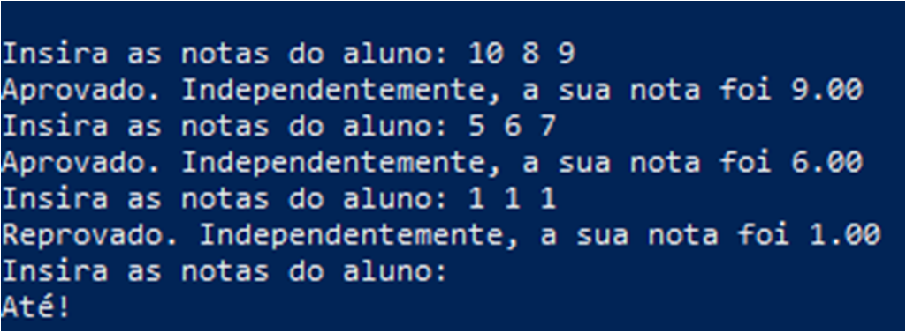

### Resolução C

```c
#include <stdio.h>
#include <stdlib.h>
#include <string.h>
// 
int main(){
    float n=0.0;
    char*inp=(char*)malloc(2*sizeof(inp)),*split;
    printf("Insira as notas do aluno(uma linha): ");
    fgets(inp,10,stdin);
    for(int i=0;split=strtok_r(inp," ",&inp);++i){
        n+=atof(split)/3.0;
    }
    if(n<6.0){
        printf("Reprovado(ao som do seu Madruga)! ");
    } else{
        printf("Aprovado! ");
    }
    printf("Independente da sua condicao, voce tirou %.2f",n);
    return 0;
}
```

#### Exemplo de Output+Input:
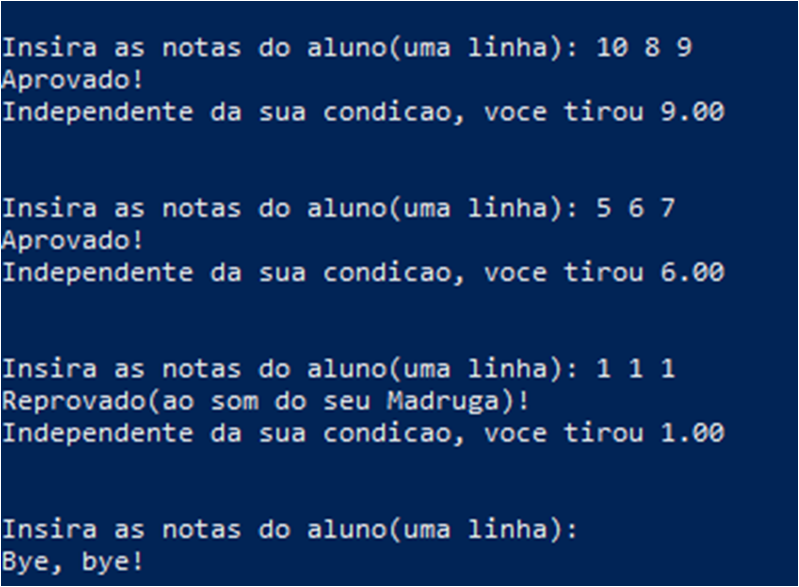

## Questão 2
### Enunciado
Ler 2 valores referentes a 2 notas de um aluno e exibir uma mensagem dizendo que
o aluno foi aprovado, se o valor da média for maior ou igual a 6.0. Se o valor da média
for menor que 6.0, solicitar a nota de exame, somar com o valor da média e obtiver
uma nova média. Se a nova média for maior ou igual a 5, exibir mensagem dizendo
que o aluno foi aprovado em exame. Se o aluno não foi aprovado, exibir uma
mensagem informando essa condição. Exibir junto com uma das mensagens, o valor
da média para qualquer condição.
### Resolução Python
```py
print()
x=list(map(float,input('Insira as notas: ').split()))
if (x[0]+x[1])/2>=6:
    print('Aprovado! A sua nota foi: {:.2f}'.format((x[0]+x[1])/2))
else:
    x.append(float(input('Insira a nota do exame: ')))
    print('Aprovado por exame') if (x[0]+x[1]+x[2])/3>=5 else print('Reprovado de qualquer jeito')
    print('Ainda assim, a sua nota foi {:.2f}'.format((x[0]+x[1]+x[2])/3))
print()
```
#### Exemplo de Output+Input:
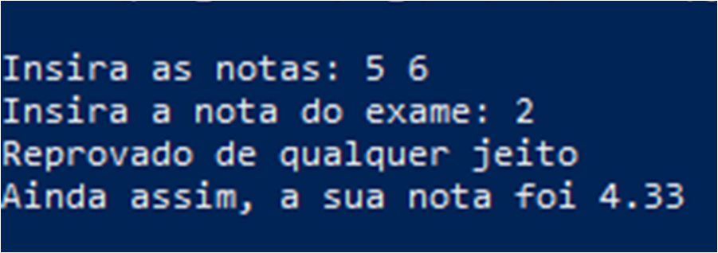
### Resolução C
```c
#include<stdio.h>
#include<stdlib.h>
#include<string.h>
//
int main(){
	float v[2],n;
	char*inp=(char*)malloc(10*sizeof(*inp)),*split;
	printf("\nInsira as notas do aluno(uma linha): ");
	fgets(inp,10,stdin);
	for(int i=0;split=strtok_r(inp," ",&inp);++i){
		v[i]=atof(split);
	}
	free(inp);
	n=(v[1]+v[0])/2.0;
	if(n<6.0){
		char*sit=(char*)malloc(10*sizeof(*sit)),*inp=(char*)malloc(3*sizeof(*inp));
		sit="Aprovado!";
		printf("Isso nao e bom, faca o exame(fez o exame).\nAgora insira a nota do exame: ");
		fgets(inp,10,stdin);
		n=(v[0]+v[1]+atof(inp))/3.0;
		n<5.0?sit="Reprovado!":sit;
		printf("%s",sit);
	} else {
		printf("Parabens!Te vejo no proximo bimestre!\n");
	}
	printf("Independe da sua condicao, voce tirou %.2f\n\n",n);
	free(inp);
	return 0;
}
```
#### Exemplode de Output+Input:
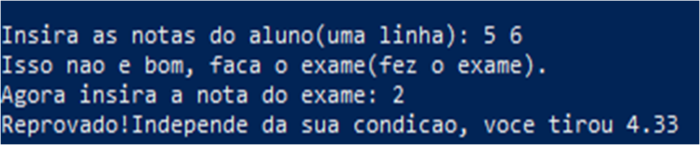


## Questão 3
### Enunciado
Ler dois valores numéricos e exibir a diferença do maior para o menor
### Resolução Python
```py
print()
x=list(map(float,input('Insira os valores: ').split()))
print('A diferença entre eles é: ',max(x)-min(x))
print()
```
#### Ememplo de Output+Input:
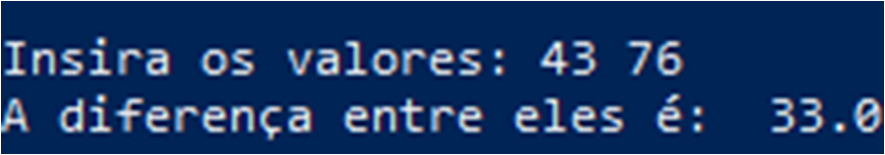
### Resolução C
```c
#include<stdio.h>
#include<stdlib.h>
#include<string.h>
//
int main(){
	float MAX_VALUE=20000000.0,*v=(float*)calloc(2,sizeof(*v)),*ponte=(float*)calloc(1,sizeof(*ponte));
	v[1]=MAX_VALUE;
	char*inp=(char*)malloc(200*sizeof(*inp)),*split;
	printf("Insira, no maximo, 100 valores, em uma linha: ");
	fgets(inp,200,stdin);
	for(int i=0;split=strtok_r(inp," ",&inp);++i){
		*ponte=atof(split);
		*ponte<v[1]?v[1]=*ponte:v[1];
		*ponte>v[0]?v[0]=*ponte:v[0];
	}
	free(ponte);
	free(inp);
	printf("A diferenca entre o maior numero, %.2f, e o menor numero, %.2f, da lista apresentados, e: %.2f\n",v[0],v[1],v[0]-v[1]);
	free(v);
	return 0;
}
```
#### Exemplo de Output+Input:
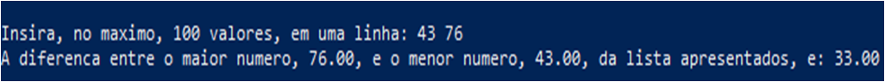

## Questão 4
### Enunciado
Ler três valores para os lados de um triangulo, considerando lados como: A, B e C.
Verificar se os lados fornecidos formam realmente um triangulo, e se essa condição for
verdadeira, indicar qual o tipo do triangulo formado: isósceles, escaleno ou equilátero.
Triangulo é uma forma geométrica (polígono) composta de 3 lados, onde cada lado é
menor que a soma dos dois outros lados.
REGRA BÁSICA: Será um triangulo quando A<B+C, quando B<A+C e quando C<A+B.
Um triangulo é isósceles quando possui 2 lados iguais e um diferente, sendo A==B ou
A==C ou B==C; é escaleno quando possui todos os lados diferentes, sendo A<>B e
B<>C e é equilátero quando possui todos os lados iguais, sendo A==B e B==C.
Ler 3 valores para os lados de um triangulo: A, B e C.
Verificar se cada lado é menor que a soma dos dois outros lados. Se sim, saber se A=B
e se B=C, sendo verdade exibir, o triangulo é equilátero, se não verificar A=B ou se
A=C ou se B=C, sendo verdade exibir o triangulo é isósceles, caso contrário, o
triangulo é escaleno.
Caso os lados não se caracterizem um triangulo, exibir mensagem informando a
ocorrência
#### Resolução Python
```py
while True:
    print()
    x=list(map(float,input('Insira o valor dos lados do triângulo: ').split()))
    if len(x)<1:
        break;
    v=0 
    rep=0
    tri=True
    for i in range(3):
        for j in range(3):
            v+=x[j] if j!=i else 0
            rep+=1 if x[i]==x[j] and j!=i else 0
        tri=x[i]<=v
        if tri==False:
            break
        v=0
    if tri:
        out='Escaleno'
        if rep==2:
            out='Isósceles'
        elif rep==6:
            out='Equilátero'
        print('Seu tipo é {}'.format(out))
    else:
        print('Isso não é um triângulo')
    print()
print('Até!\n')
```
#### Exemplo de Output+Input
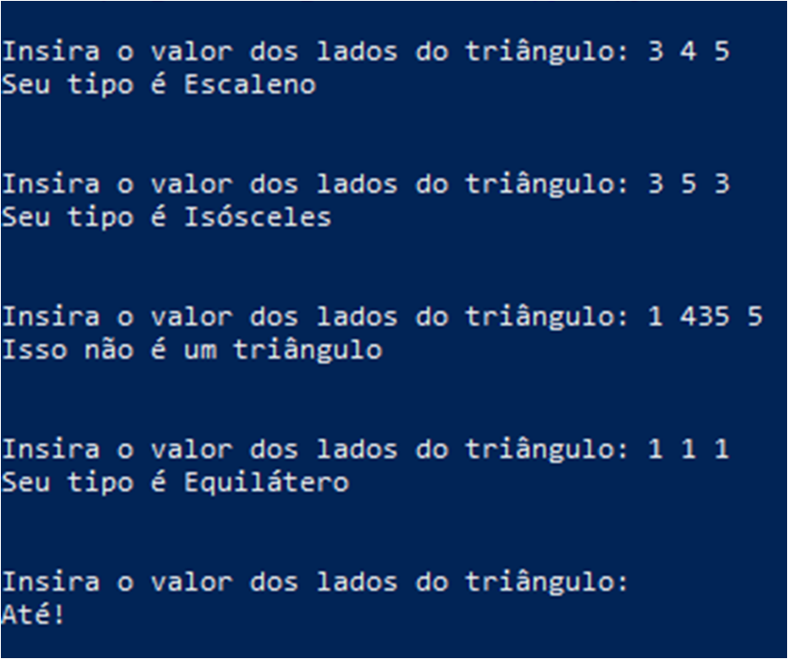
### Resolução C
```c
#include<stdio.h>
#include<string.h>
#include<stdlib.h>
#include<stdbool.h>
//
int main(){
	bool cont;
	printf("\n");
	for(;;){
		cont=true;
		bool para=false,e=true;
		float*v=(float*)calloc(3,sizeof(*v));
		char*inp=(char*)malloc(20*sizeof(*inp)),*split;
		printf("Insira os laods de um triangulo(uma linha): ");
		fgets(inp,20,stdin);
		for(int i=0;split=strtok_r(inp," ",&inp);++i){
			if(i>2){
				printf("Oxente, desde quando isso e um triangulo?\n");
				para=true;
				break;
			}
			i==1?cont=false:cont;
			v[i]=atof(split);
		}
		if(cont){
			break;
		}
		free(inp);
		if(!para){
			float aux=0.0;
			for(int i=0;i<3;++i){
				for(int j=0;j<3;++j){
					j!=i?aux+=v[j]:aux;
				}
				if(v[i]>aux){
					printf("Oxente, desde quando isso e um triangulo?\n");
					e=false;
					break;
				}
				aux=0;
			}
			if(e){
				char*out=(char*)malloc(15*sizeof(*out));
				out="Equilatero";
				v[0]!=v[1]&&v[1]!=v[2]&&v[0]!=v[2]?out="Escaleno":v[0]==v[1]&&v[1]!=v[2]?out="Isoceles":v[1]==v[2]&&v[1]!=v[0]?out="Isoceles":v[0]==v[2]&&v[2]!=v[1]?out="Isoceles":out;
				printf("Ok...\no tipo do triangulo e: %s\n\n",out);
			}
		}
		free(v);
	}
	printf("Bye, bye!");
	return 0;
}
```
#### Ememplo de Output+Input:
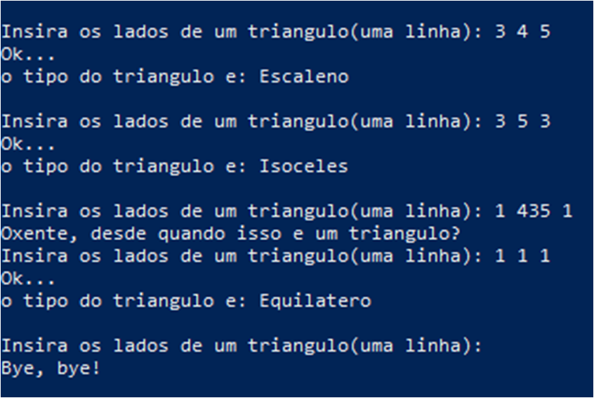

## Questão 5
### Enunciado
Ler 3 valores (A, B e C) e exibir os valores dispostos em ordem crescente.
### Resolução Python
```py
print()
x=list(map(float,input('Itens a serem organizados: ').split()))
x.sort()
for i in x:
    print(i,end=' ')
print('\n')
```
#### Exemplo de Output+Input:
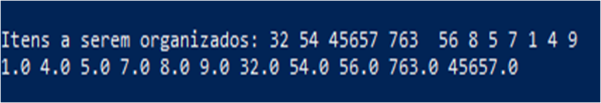
### Resolução C
```C
#include<stdio.h>
#include<stdlib.h>
#include<string.h>
//
int main(){
	printf("\n");
	int e=0;
	float*v=(float*)calloc(100,sizeof(*v));
	char*inp=(char*)malloc(200*sizeof(*inp)),*split;
	printf("Insira, no maximo, 100 valores(em uma linha): ");
	fgets(inp,100,stdin);
	for(int i=0;split=strtok_r(inp," ",&inp);++i){
		v[i]=atof(split);
		++e;
	}
	for(int i=0;i<e;++i){
		for(int j=0;j<e;++j){
			if(v[i]<v[j]){
				v[j]+=v[i];
				v[i]=v[j]-v[i];
				v[j]-=v[i];
			}
		}
	}
	for(int i=0;i<e;++i){
		printf("%.2f ",v[i]);
	}
	free(v);
	free(inp);
	printf("\n\n");
	return 0;
}
```
#### Exemplo de Output+Input:
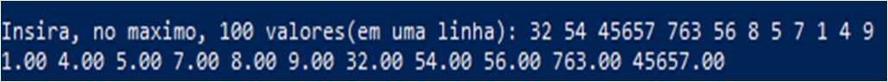

## Questão 6
### Enunciado
Ler 3 valores (A, B e C) e calcular a equação de segundo grau, exibindo as duas
raízes, se para os valores informados for possível efetuar o referido cálculo
### Resolução Python
```py
print()
while True:
    x=list(map(float,input('Insira uma equação do 2º grau: ').split()))
    if len(x)<1:
        break
    if (x[1]**2)-(4*x[0]*x[2])<0:
        print('A equação não possui resolução')
    else:
        d=(x[1]**2)-(4*x[0]*x[2])
        print('Resposta=[ {:.2f} ; {:.2f} ]'.format((-x[1]+(d**0.5))/(2*x[0]),(-x[1]-(d**0.5))/(2*x[0])))
print('Até!\n')
```
#### Exemplo de Output+Input:
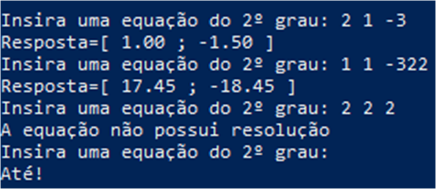
### Resolução C
```c
#include<stdio.h>
#include<stdlib.h>
#include<string.h>
#include<math.h>
#include<stdbool.h>
//
int main(){
	bool ctrl;
	for(;;){
		ctrl=true;
		printf("\n");
		double*v=(double*)calloc(3,sizeof(*v)),delta;
		char*inp=(char*)malloc(20*sizeof(*inp)),*split,*slot;
		printf("X = ");
		fgets(inp,20,stdin);
		for(int i=0;split=strtok_r(inp," ",&inp);++i){
			v[i]=strtod(split,&slot);
			i==1?ctrl=false:ctrl;
		}
		if(ctrl){
			break;
		}
		delta=pow(v[1],2.0)-4.0*v[0]*v[2];
		free(inp);
		if(delta<0){
			printf("Essa equacao nao possui resolucao!\n");
		} else{
			printf("X' = %.2f\nX'' = %.2f\n",(-v[1]+pow(delta,0.5))/(2.0*v[0]),(-v[1]-pow(delta,0.5))/(2.0*v[0]));
		}
		printf("\n");
		free(v);
	}
	printf("Bye, bye!\n");
	return 0;
}
```
#### Exemplo de Output+Input:
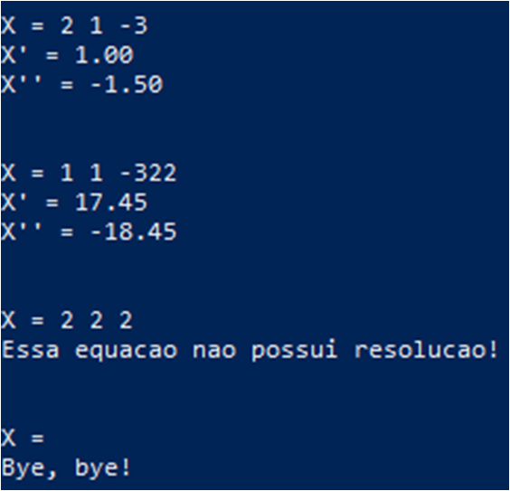

## Questão 7
### Enunciado
Ler um valor inteiro positivo ou negativo e exibir o número lido como sendo um valor
positivo, ou seja, o programa devera exibir o modulo de um número fornecido. Lembrese de verificar se o número fornecido é menor que zero; sendo, multiplique-o por -1
### Resolução Python
```py
print()
x=int(input('Insira algum valor: '))
print('O seu modúlo vale:',end=' ')
print(x*-1) if x<0 else print(x)
print()
```
#### Exemplo de Output+Input:
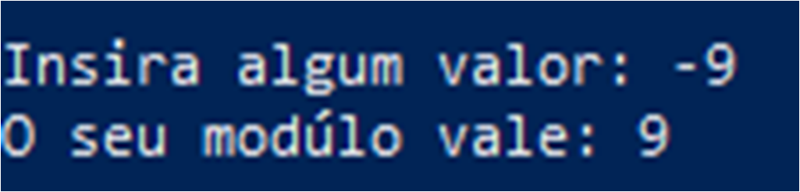
### Resolução C
```c
#include<stdio.h>
#include<stdlib.h>
#include<string.h>
//
int main(){
	printf("\n");
	int ponte;
	char*inp=(char*)malloc(200*sizeof(*inp)),*split;
	printf("Insira valores inteiros(uma linha): ");
	fgets(inp,100,stdin);
	printf("Os seus modulos sao, respectivamente: ");
	for(int i=0;split=strtok_r(inp," ",&inp);++i){
		ponte=atoi(split);
		ponte<0?ponte*=-1:ponte;
		printf("%i ",ponte);
	}
	printf("\n\n");
	free(inp);
	return 0;
}
```
#### Exemplo de Output+Input:
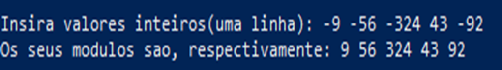

## Questão 8
### Enunciado
Ler 3 números inteiros e exibir os números que são divisíveis por 2 e 3.
### Resolução Python
```py
print()
while True:
    x=input('Insira os valores: ').split()
    if len(x)<1:
        break
    men=False
    for i in x:
        su=0
        for j in i:
            su+=int(j)
        if su%3==0 and int(i[len(i)-1])%2==0:
            print(i,end=' ')
            men=True
    if men:
        print('são numeros divisiveis por 6')
print('Até!\n')
```
#### Exemplo de Output+Input
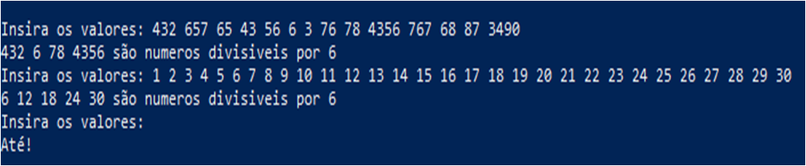
### Resolução C
```c
#include<stdio.h>
#include<stdlib.h>
#include<string.h>
#include<stdbool.h>
//
int main(){
	printf("\n");
	int e,e_2,e_3,q_n,quant;
	bool ctrl;
	for(;;){
		char*inp=(char*)malloc(1000*sizeof(*inp)),ult[1];
		printf("Insira: ");
		fgets(inp,1000,stdin);
		ctrl=true;
		e=0;
		for(int i=0;i<1000;++i){
			if((int)inp[i]<48||(int)inp[i]>57){
				if((int)inp[i]!=32){
					break;
				}
			}
			if((int)inp[i]==32){
				++q_n;
			}
			++e;
			ctrl=false;
		}
		if(ctrl){break;}
		e_2=e_3=quant=0;
		inp[e]=' ';
		++e;
		char**ns=(char**)calloc((q_n+1),sizeof(**ns));
		char*temp=(char*)malloc(200*sizeof(*temp));
		for(int i=0;i<e;++i){		
			if((int)inp[i]==32){
				if(quant%3==0&&(ult[0]-'0')%2==0){
					//printf("%c%c\n",temp[0],temp[1]);
					ns[e_3]=(char*)malloc(e_2+1*sizeof(char));
					for(int j=0;j<e_2+1;++j){
						if((int)temp[j]<48||(int)temp[j]>57){
							break;
						}	
						ns[e_3][j]=temp[j];
					}
					++e_3;
				}
				for(int i=0;i<e_2+1;++i){
					temp[i]='_';
				}
				e_2=0;
				quant=0;
			} else{
				quant+=inp[i]-'0';
				ult[0]=inp[i];
				temp[e_2]=inp[i];
				++e_2;
			}

		}
		printf("n-> ");
		for(int i=0;i<e_3;++i){
			for(int j=0;j<strlen(ns[i]);++j){
				if((int)ns[i][j]<48||(int)ns[i][j]>57){
					break;
				}
				printf("%c",ns[i][j]);
			}
			printf(" ");
		}
		printf("\n");
		free(inp);
		free(temp);
		free(ns);
	}
	printf("Bye,bye\n\n");
	return 0;
}
```
### Exemplo de Output+Input
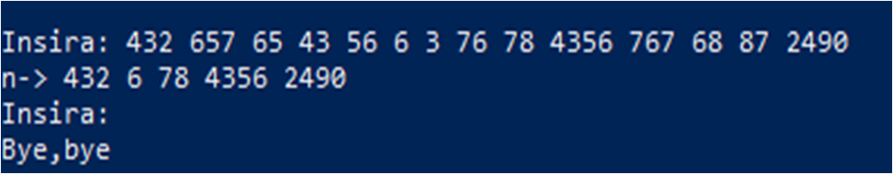

## Questão 9
### Enunciado
Ler 2 números inteiros e exibir os números que são divisíveis por 4 ou 5
#### Resolução Python
```py
print()
while True:
    x=input('Insira os valores: ').split()
    if len(x)<1:
        break
    ok=False
    for i in x:
        q=''
        q_r=''
        for j in range(3):
            if j>len(i)-1:
                break
            q+=i[len(i)-1-j]
        for j in range(len(q)):
            q_r+=q[len(q)-1-j]
        if int(q_r)%4==0 or int(i[len(i)-1])%5==0:
            print(i,end=' ')
            ok=True
    if ok:
        print('são números divisíveis por 4||5')
print('Até!\n')
```
#### Exemplo de Output+Input:
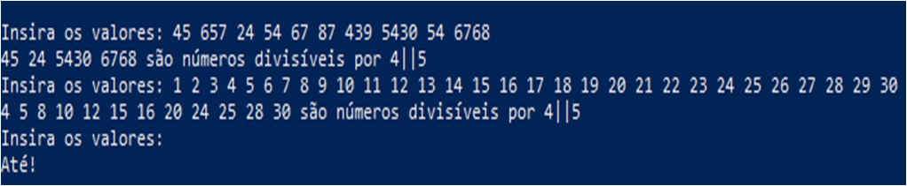
### Resolução C
```c
#include<stdio.h>
#include<stdlib.h>
#include<string.h>
#include<stdbool.h>
//
int main(){
	printf("\n");
	int e_1,e_2,e_3,quant,m;
	char u[1];
	bool ctrl;
	for(;;){
		quant=0;
		e_1=0;
		ctrl=true;
		char*inp=(char*)malloc(1000*sizeof(*inp)),**slot;
		printf("Insira: ");
		fgets(inp,1000,stdin);
		for(int i=0;i<1000;++i){
			if((int)inp[i]==32){
				++quant;	
			} else if((int)inp[i]<48||(int)inp[i]>57){
				break;
			}
			++e_1;
			ctrl=false;
		}
		if(ctrl){
			break;
		}
		inp[e_1]=' ';
		++e_1;
		e_2=e_3=0;
		slot=(char**)malloc((quant+1)*sizeof(char));
		char*aux=(char*)malloc(200*sizeof(*aux)),*temp;
		for(int i=0;i<e_1;++i){
			if((int)inp[i]==32){
				if(e_2<4){
					temp=(char*)malloc(e_2*sizeof(*temp));
					m=e_2-1;
				}else{
					temp=(char*)malloc(3*sizeof(*temp));
					m=2;
				}
				--e_2;
				for(int j=0;j<3;++j){
					//printf("%c\n",aux[e_2-j]);
					if((int)aux[e_2-j]<48||(int)aux[e_2-j]>57||e_2-j<0){
						break;
					}
					temp[m-j]=aux[e_2-j];
				}
				//printf("%s\n",temp);
				if(atoi(temp)%4==0||(u[0]-'0')%5==0){
					slot[e_3]=(char*)malloc((e_2+1)*sizeof(char));
					for(int j=0;j<e_2+1;++j){
						if((int)aux[e_2-j]<48||(int)aux[e_2-j]>57){
							break;
						}
						slot[e_3][e_2-j]=aux[e_2-j];
					}
					++e_3;
				}
				for(int j=0;j<200;++j){
					aux[j]='_';
				}
				for(int j=0;j<m;++j){
					temp[j]='_';
				}
				e_2=0;
				free(temp);
			} else{
				aux[e_2]=inp[i];
				u[0]=inp[i];
				++e_2;
			}
		}
		printf("n-> ");
		for(int i=0;i<e_3;++i){
			for(int j=0;j<200;++j){
				if((int)slot[i][j]>57||(int)slot[i][j]<48){
					printf(" ");
					break;
				}
				printf("%c",slot[i][j]);
			}
		}
		printf("\n");
		free(inp);
		free(aux);
	}
	printf("Bye, bye\n\n");
	return 0;
}
```
#### Exemplo de Output+Input:
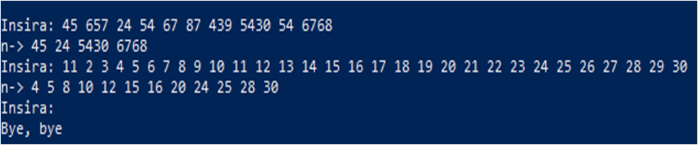

## Questão 10
### Enunciado
Faça um algoritmo que receba como entrada o mês (de 1 a 12) e retorne o nome
do respectivo mês. (Utilizar caso/seja)
### Resolução Python
```py
print()
match input('Insira o mês: '):
    case '1':
        x='Janeiro'
    case '2':
        x='Faveiro'
    case '3':
        x='Março'
    case '4':
        x='Abril'
    case '5':
        x='Maio'
    case '6':
        x='Junho'
    case '7':
        x='Julho'
    case '8':
        x='Agosto'
    case '9':
        x='Setembro'
    case '10':
        x='Outubro'
    case '11':
        x='Novembro'
    case '12':
        x='Dezembro'
    case _:
        x='Mes inválido'
print(x,'\n')
```
#### Exemplo de Output+Input
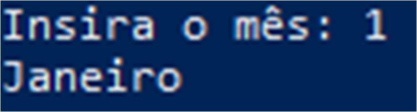
### Resolução C
```c
#include<stdio.h>
#include<string.h>
#include<stdlib.h>
//
int main(){
    char bgl[3],*out=(char*)malloc(20*sizeof(*out)),*inp=(char*)malloc(3*sizeof(*inp));
    printf("\nInsira um mes: ");
    scanf("%s",inp);
    if(strcmp(inp,"1")==0)
        out="Janeiro";
    else if(strcmp(inp,"2")==0)
        out="Fevereiro";
    else if(strcmp(inp,"3")==0)
        out="Marco";
    else if(strcmp(inp,"4")==0)
        out="Abril";
    else if(strcmp(inp,"5")==0)
        out="Maio";
    else if(strcmp(inp,"6")==0)
        out="Junho";
    else if(strcmp(inp,"7")==0)
        out="Julho";
    else if(strcmp(inp,"8")==0)
        out="Agosto";
    else if(strcmp(inp,"9")==0)
        out="Setembro";
    else if(strcmp(inp,"10")==0)
        out="Outubro";
    else if(strcmp(inp,"11")==0)
        out="Novembro";
    else if(strcmp(inp,"12")==0)
        out="Dezembro";
    else
        out="Invalido";
    printf("%s\n\n",out);
    return 0;
}
```
#### Exemplo de Output+Input
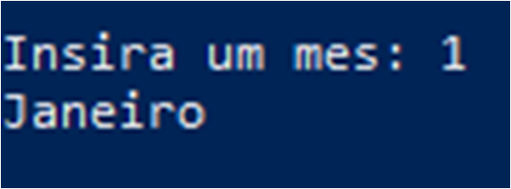
# Casa

## Questão 1
### Enunciado
Elaborar um programa em que informe se o número digitado pelo usuário é par ou
impar
### Resolução Python
```py
print()
while True:
        x=input('Insira os valores: ').split(' ')
        if(x[0]==''): break
        ok=False
        for i in x:
            if int(i[len(i)-1])%2==0:
                print(i,end=' ')
                ok=True
        if ok:
            print('são números divíveis por dois\n')
print("Até!\n")
```
#### Exemplo de Output+Input
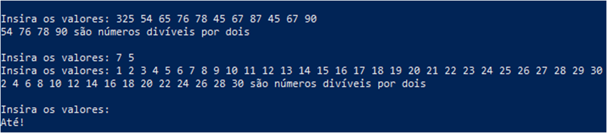
### Resolução C
```c
#include<stdio.h>
#include<stdlib.h>
#include<string.h>
#include<stdbool.h>
//
int main(){
    bool ctrl;
    int q,e_1,e_2,e_3;
    char u[1],*inp,**par,*aux;
    for(;;){
   	 q=e_1=e_2=e_3=0;
   	 ctrl=true;
   	 inp=(char*)malloc(1000*sizeof(*inp));
     printf("Insira os valores: ");
   	 fgets(inp,1000,stdin);
   	 for(int i=0;i<1000;++i){
   		 if(inp[i]==32){
   			 ++q;
   		 }else if((int)inp[i]<48||(int)inp[i]>57){
   			 break;
   		 }
   		 ctrl=false;
   		 ++e_1;
   	 }
   	 inp[e_1]=' ';
   	 ++e_1;
   	 if(ctrl)
   		 break;
   	 par=(char**)malloc((q+1)*sizeof(char*));
   	 aux=(char*)malloc((e_1+1)*sizeof(char));
   	 for(int i=0;i<e_1;++i){
   		 if((int)inp[i]==32){
   			 if((u[0]-'0')%2==0){
   				 par[e_3]=(char*)malloc((e_2-1)*sizeof(char));
   				 for(int j=0;j<e_2;++j){
   					 //printf("%c",aux[j]);
   					 par[e_3][j]=aux[j];
   				 }
   				 //printf("\n");
   				 ++e_3;
   			 }
   			 for(int j=0;j<e_2;++j){
   				 aux[j]=' ';
   			 }
   			 e_2=0;
   		 } else{
   			 aux[e_2]=inp[i];
   			 //printf("%c\n",inp[i]);
   			 u[0]=inp[i];
   			 ++e_2;
   		 }
   	 }
   	 for(int i=0;i<e_3;++i){
   		 for(int j=0;j<strlen(par[i]);++j){
                if((int)par[i][j]<48||(int)par[i][j]>57){
                    break;
                }
   			    printf("%c",par[i][j]);
   		 }
   		 printf(", ");
   	 }
     printf("sao valores divisiveis por dois");
   	 printf("\n");
   	 free(par);
   	 free(aux);
    }
    printf("Bye, bye!\n");
    return 0;
}
```
#### Exemplo de Output+Input
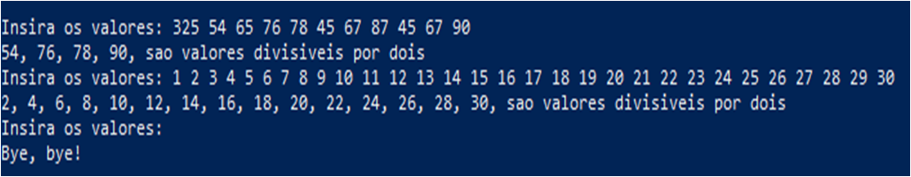

## Questão 2
### Enunciado
Digitado um número inteiro entre 0 e 100, informar o quanto ele está distante de um
determinado número chave, carregado no próprio programa. Ex.: Número chave=20,
número digitado=15, resposta=5. Número chave=17, número digitado=20, resposta=3
(Obs.: a resposta deverá ser sempre um número positivo).
### Resolução Python
```py
print()
while True:
    x=list(map(float,input('Insira dois valores: ').split()))
    if len(x)<1:
        break
    v=x[1]-x[0]
    v*=-1 if v<0 else 1
    print('A diferença entre os valores é: {:.2f}'.format(v))
print('Até!\n')
```
#### Exemplo de Output+Input
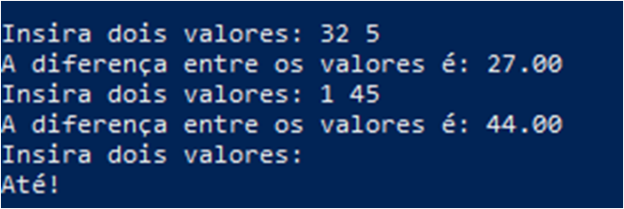
### Resolução C
```c
#include<stdio.h>
#include<string.h>
#include<stdbool.h>
#include<stdlib.h>
//
int main(){
    bool ctrl;
    float v[2];
    char*inp,*split;
    printf("Insira dois valores para descobrir a distancia entre eles\n");
    for(;;){
        inp=(char*)malloc(100*sizeof(*inp));
        printf("*: ");
        fgets(inp,100,stdin);
        ctrl=true;
        for(int i=0;split=strtok_r(inp," ",&inp);++i){
            (int)split[0]>46&&(int)split[0]<58?ctrl=false:ctrl;
            v[i]=atof(split);
        }
        if(ctrl){
            break;
        }
        if (v[0]>v[1]){
            printf("%.2f\n",v[0]-v[1]);
        }else{
            printf("%.2f\n",v[1]-v[0]);
        }
    }
    printf("Bye, bye!");
    return 0;
}
```
#### Exemplo de Output+Input
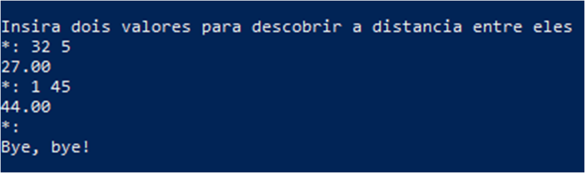

## Questão 3
### Enunciado
Uma Universidade tem problemas com arredondamento das médias dos alunos,
pois cada professor estipula um critério de arredondamento. Devemos elaborar um
programa, em Linguagem C++, para a secretaria da Universidade, resolvendo esse
problema. O programa deve solicitar uma nota e fazer o devido arredondamento.
Regras:
Notas que ultrapassem 0,5 de resto serão arredondas para CIMA.
Ex: 4,6 –>5,0
Notas que abaixo ou igual a 0,5 de resto serão arredondas para BAIXO.
Ex: 4,5 –> 4,0
### Resolução Python
```py
print()
while True:
    x=list(map(float,input('Insira as notas dos alunos: ').split()))
    if len(x)<1:
        break
    for i in x:
        print("{:.0f},0".format(i),end=' ')
    print('\n')
print('Até!\n')
```
#### Exemplo de Output+Input
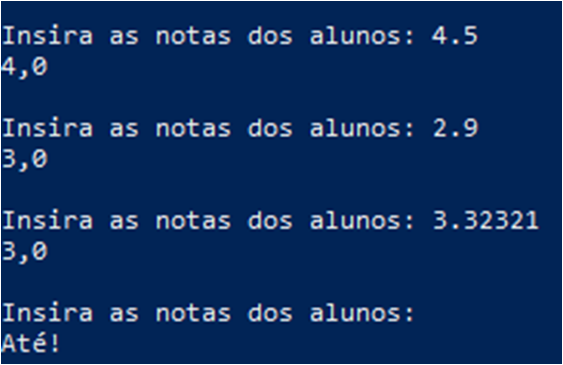
### Resolução C
```c
#include<stdio.h>
#include<string.h>
#include<stdlib.h>
#include<stdbool.h>
//
int main(){
    bool ctrl;
    for(;;){
        printf("Insira as notas dos alunos: ");
        ctrl=true;
        char*inp=(char*)malloc(1000*sizeof(*inp)),*split;
        fgets(inp,1000,stdin);
        for(;split=strtok_r(inp," ",&inp);){
            (int)split[0]>46&&(int)split[0]<58?ctrl=false:ctrl;
            if(ctrl){
                break;
            }
            printf("%.0f,0 ",atof(split));
        }
        if(ctrl){
            break;
        }
        printf("\n");
    }
    printf("Bye, bye!\n");
    return 0;
}
```
#### Exemplo de Output+Input
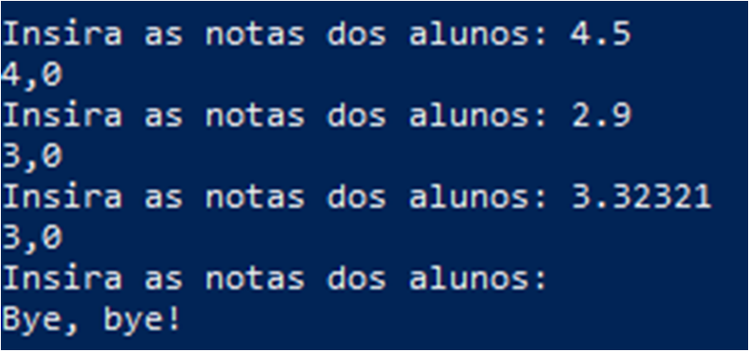

## Questão 4
### Enunciado
Faça um programa que leia 3 números e exiba:
a) O maior número;
b) O menor número;
c) O número do meio
### Resolução Python
```py
print()
while True:
    x=list(map(float,input('Insira n valores: ').split()))
    if len(x)<1:
        break
    x.sort()
    x.reverse()
    print('Organização decresente->',end=' ')
    for i in x:
        print('{:.2f}'.format(i),end=' ')
    print('\n')
print('Até!\n')
```
#### Exemplo de Output+Input
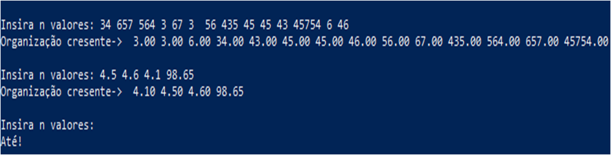

### Resolução C
```c
#include<stdio.h>
#include<stdlib.h>
#include<stdbool.h>
#include<string.h>
//
int main(){
    printf("\n");
    bool ctrl;
    int q;
    float*v;
    char*inp,*split;
    for(;;){
        q=0;
        printf("Insira os valores a serem organizados: ");
        ctrl=true;
        inp=(char*)malloc(1000*sizeof(char));
        fgets(inp,1000,stdin);
        for(int i=0;i<1000;++i){
            if((int)inp[i]==32){
                ++q;
            } else if((int)inp[i]<46||(int)inp[i]>57){
                break;
            }
            ctrl=false;
        }
        if(ctrl){
            break;
        }
        ++q;
        v=(float*)calloc(q,sizeof(float));
        for(int i=0;split=strtok_r(inp," ",&inp);++i){
            v[i]=atof(split);
        }
        for(int i=0;i<q;++i){
            for(int j=0;j<q;++j){
                if(v[i]>v[j]){
                    v[i]+=v[j];
                    v[j]=v[i]-v[j];
                    v[i]-=v[j];
                }
            }
        }
        for(int i=0;i<q;++i){
            printf("%.2f ",v[i]);
        }
        printf("e a sua forma mais organizada");
        printf("\n\n");
    }
    printf("Bye, bye!\n");
    return 0;
}
```
#### Exemplo de Output+Input
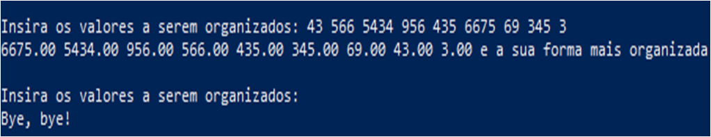

## Questão 5
### Enunciado
- Faça o programa que calcule o salário líquido dos funcionários de uma empresa. O
salário líquido é composto por descontos e adicionais, seguindo as seguintes regras:
Descontos:
Salário bruto < 800,00 – não realizar nenhum desconto;
800,00 <= Salário bruto <=1600,00 – descontar 8% de Imposto de Renda e 5
% de encargos.
>1600,00 – descontar 15% de Imposto de Renda e 7% de encargos.
Adicionais:
Caso o funcionário tenha trabalhado mais de 160 horas no mês, divida o seu salário
bruto por 160 (representa horas trabalhadas) e calcule 50% de adicional nas horas
que excederam a 160.
O usuário deverá digitar o salário bruto e o número de horas trabalhadas no mês de
cada funcionário, e deverá receber como resultado o salário líquido. O usuário poderá
calcular salário para N funcionários, para finalizar o programa o usuário deverá digitar
0 no salário bruto, ao finalizar o programa exibir o total geral dos salários líquidos.
### Resolução Python
```py
i=0
print()
while True:
    print("Insira os dados do {} funcionário, salario e horas, uma linha:".format(i),end=' ')
    x=list(map(float,input().split()))
    if x[0]==0:break
    x[0]-=(x[0]*0.13) if x[0]>=800 and x[0]<=1600 else 0
    x[0]-=(x[0]*0.22) if x[0]>1600 else 0
    x[0]+=(x[1]-160)*(0.5*(x[0]/160)) if x[1]>160 else 0
    print("O seu salário será {:.2f}R$".format(x[0]))
    i+=1
print('Até!\n')
```
#### Exemplo de Output+
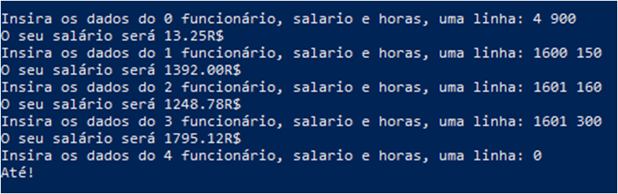
### Resolução C
```c
#include<stdio.h>
#include<stdlib.h>
#include<string.h>
//
int main(){
    char*inp,*split;
    float v[2],novo;
    for(int f=0;;++f){
        printf("Insira os dados do %i funcionario: ",f);
        char*inp=(char*)malloc(1000*sizeof(char));
        fgets(inp,1000,stdin);
        if(inp[0]=='0'){
            break;
        }
        for(int i=0;split=strtok_r(inp," ",&inp);++i){
            v[i]=atof(split);
        }
        novo=v[0];
        1600>=novo&&novo>=800?novo-=(novo*0.13):novo>1600?novo-=(novo*0.22):novo;
        v[1]>160?novo+=(v[1]-160.0)*(0.5*(novo/160.0)):novo;
        printf("O seu salario sera: %.2fR$\n",novo);
    }
    printf("Verificacao check!\n");
}
```
#### Exemplo de Output+Input
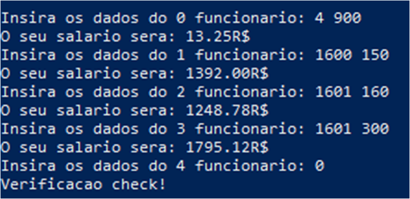

## Questão 6
### Enunciado
Faça um programa que receba como entrada o mês (de 1 a 12) e retorne o nome do respectivo mês.
### Resolução Python
```py
print()
x=input()
match x:
    case '1':
        x='Janeiro'
    case '2':
        x='Faveiro'
    case '3':
        x='Março'
    case '4':
        x='Abril'
    case '5':
        x='Maio'
    case '6':
        x='Junho'
    case '7':
        x='Julho'
    case '8':
        x='Agosto'
    case '9':
        x='Setembro'
    case '10':
        x='Outubro'
    case '11':
        x='Novembro'
    case '12':
        x='Dezembro'
    case _:
        x='Mes inválido'
print(x,'\n')
```
#### Exemplo de Output+Input
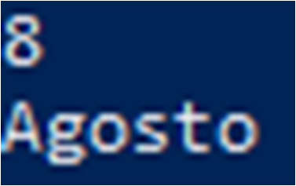
### Resolução C
```c
#include<stdio.h>
#include<string.h>
#include<stdlib.h>
//
int main(){
    char bgl[3],*out=(char*)malloc(20*sizeof(*out)),*inp=(char*)malloc(3*sizeof(*inp));
    printf("\nInsira um mes: ");
    scanf("%s",inp);
    if(strcmp(inp,"1")==0)
        out="Janeiro";
    else if(strcmp(inp,"2")==0)
        out="Fevereiro";
    else if(strcmp(inp,"3")==0)
        out="Marco";
    else if(strcmp(inp,"4")==0)
        out="Abril";
    else if(strcmp(inp,"5")==0)
        out="Maio";
    else if(strcmp(inp,"6")==0)
        out="Junho";
    else if(strcmp(inp,"7")==0)
        out="Julho";
    else if(strcmp(inp,"8")==0)
        out="Agosto";
    else if(strcmp(inp,"9")==0)
        out="Setembro";
    else if(strcmp(inp,"10")==0)
        out="Outubro";
    else if(strcmp(inp,"11")==0)
        out="Novembro";
    else if(strcmp(inp,"12")==0)
        out="Dezembro";
    else
        out="Invalido";
    printf("%s\n\n",out);
    return 0;
}
```
#### Exemplo de Output+Input
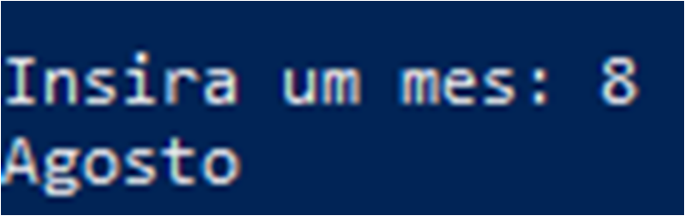

## Questão 7
### Enunciado
Entrar um código de acesso a um curso. Se o código for 1, 2,3,4 e 5 exibir na telaEngenharia, Edificações, Sistemas Elétricos, Turismo e Análise de Sistemas respectivamente; caso contrário exibir que o código é inválido.
### Resolução Python
```py
x=input('\n')
match x:
    case '1':
        x='Engenharia'
    case '2':
        x='Edificações'
    case '3':
        x='Sistemas Elétricos'
    case '4':
        x='Turismo'
    case '5':
        x='Análise de Sistemas'
    case _:
        x='Inválido'
print(x,'\n')
```
#### Exemplo de Output+Input
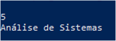
### Resolução C
```c
#include<stdio.h>
#include<string.h>
#include<stdlib.h>
//
int main(){
    char*inp=(char*)malloc(3*sizeof(*inp)),*out=(char*)malloc(20*sizeof(*out));
    printf("\nInsira o numero do curso: ");
    scanf("%s",inp);
    if(strcmp(inp,"1")==0)
        out="Engenharia";
    else if(strcmp(inp,"2")==0)
        out="Edificações";
    else if(strcmp(inp,"3")==0)
        out="Sistemas Elétricos";
    else if(strcmp(inp,"4")==0)
        out="Turismo";
    else if(strcmp(inp,"5")==0)
        out="Analise de Sistemas";
    else 
        out="Curso invalido";
    printf("%s\n\n",out);
    return 0;
}
```
#### Exemplo de Output+Input
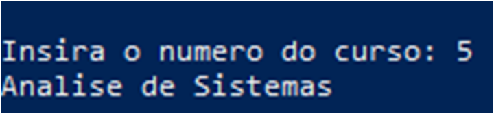
